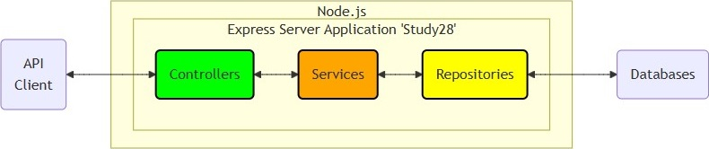

# Study28 README Contents

## Research on Express web framework and databases

Project sections:

1. [Business Logic](#-business-logic)
2. [Docker Build and Test](#-docker-build-and-test)
3. [Local Build and Test](#-local-build-and-test)

---

## ❶ Business Logic

 1.1. The diagrams.

- 🔸 Layered architecture diagrams
  - [Layer dependencies](https://github.com/k1729p/Study28/blob/main/docs/mermaid/layerDependenciesDiagram.md)
  - [Layer data flow](https://github.com/k1729p/Study28/blob/main/docs/mermaid/layerDataFlowDiagram.md)
- 🔸 Class diagrams
  - [Models](https://github.com/k1729p/Study28/blob/main/docs/mermaid/classDiagramModels.md)
  - [Controllers](https://github.com/k1729p/Study28/blob/main/docs/mermaid/classDiagramControllers.md)
  - [Services](https://github.com/k1729p/Study28/blob/main/docs/mermaid/classDiagramServices.md)
  - [Repositories](https://github.com/k1729p/Study28/blob/main/docs/mermaid/classDiagramRepositories.md)
- 🔸 Entity relationship diagrams
  - [Cassandra](https://github.com/k1729p/Study28/blob/main/docs/mermaid/entityRelationshipCassandra.md)
  - [Elasticsearch](https://github.com/k1729p/Study28/blob/main/docs/mermaid/entityRelationshipElasticsearch.md)
  - [MongoDB](https://github.com/k1729p/Study28/blob/main/docs/mermaid/entityRelationshipMongoDB.md)
  - [MySQL](https://github.com/k1729p/Study28/blob/main/docs/mermaid/entityRelationshipMySQL.md)
  - [Neo4j](https://github.com/k1729p/Study28/blob/main/docs/mermaid/flowchartNeo4jGraph.md)
  - [Oracle](https://github.com/k1729p/Study28/blob/main/docs/mermaid/entityRelationshipOracle.md)
  - [PostgreSQL](https://github.com/k1729p/Study28/blob/main/docs/mermaid/entityRelationshipPostgreSQL.md)
  - [SQL Server](https://github.com/k1729p/Study28/blob/main/docs/mermaid/entityRelationshipSQL-Server.md)
  - [Redis](https://github.com/k1729p/Study28/blob/main/docs/mermaid/flowchartRedis.md)
- 🔸 Sequence diagrams
  - Load initial data
  - [Create department](https://github.com/k1729p/Study28/blob/main/docs/mermaid/sequenceDiagram.md)
  - Read department by id
  - Update department by id
  - Delete department by id
  - Create employee
  - Read employee by id
  - Update employee by id
  - Delete employee by id
  - Transfer employees

 1.2. The data stores.

| Name | Type | Storage Abstraction | Query Language | Implementation |
| :--- | :--- | :--- | :--- | :--- |
| [Cassandra][ds01] | Columnar | Table | CQL (Cassandra Query Language) | 🛠️ |
| [Chroma][ds02] | Vector Database | Collection | Chroma API (Python/JS Client) | ❌ |
| [Elasticsearch][ds03] | database | ? | Lucene? | 🛠️ |
| [MongoDB][ds04] | Document Store | Collection | MQL (MongoDB Query Language) | ✔️ |
| [MySQL][ds05] | Relational | Table | SQL | 🛠️ |
| [Neo4j][ds06] | Graph Database | Node / Relationship | Cypher | 🛠️ |
| [Oracle][ds07] | Relational | Table | PL/SQL | 🛠️ |
| [PostgreSQL][ds08] | Relational | Table | SQL | ✔️ |
| [Redis][ds09] | Key-Value / Cache | Hash / String | RESP (Redis Serialization Protocol) | 🛠️ |
| [SQL Server][ds10] | Relational | Table | T-SQL | 🛠️ |

[ds01]: <https://cassandra.apache.org/_/index.html> "Apache Cassandra"
[ds02]: <https://www.trychroma.com/> "Chroma"
[ds03]: <https://www.elastic.co/elasticsearch> "Elasticsearch"
[ds04]: <https://www.mongodb.com/products/platform/atlas-database> "MongoDB Atlas"
[ds05]: <https://www.mysql.com/> "MySQL"
[ds06]: <https://neo4j.com/product/neo4j-graph-database/> "Neo4j"
[ds07]: <https://www.oracle.com/database/free/> "Oracle AI Database 26ai"
[ds08]: <https://www.postgresql.org/> "PostgreSQL"
[ds09]: <https://redis.io/> "Redis"
[ds10]: <https://www.microsoft.com/en-us/sql-server> "Microsoft SQL Server"

- **Cassandra** is a NoSQL distributed database.
- **Neo4j** is the graph database, with native graph storage and processing.

 1.3. The environment variables file '[.env](https://github.com/k1729p/Study28/blob/main/.env)'.
In this file are users and passwords for databases.

 1.4. The TypeScript sources are located in the directory [src](https://github.com/k1729p/Study28/blob/main/src).

🔹🔹🔹🔹🔹🔹🔹🔹🔹🔹🔹🔹🔹🔹🔹🔹🔹🔹🔹🔹🔹🔹🔹🔹🔹🔹🔹

🔹 [server.ts](https://github.com/k1729p/Study28/blob/main/src/server.ts)

🔹 'Controllers' section:

- directory [controllers](https://github.com/k1729p/Study28/blob/main/src/controllers)
  - DepartmentController
    [department.controller.ts](https://github.com/k1729p/Study28/blob/main/src/controllers/department.controller.ts)
  - EmployeeController
    [employee.controller.ts](https://github.com/k1729p/Study28/blob/main/src/controllers/employee.controller.ts)
  - InitializationController
    [initialization.controller.ts](https://github.com/k1729p/Study28/blob/main/src/controllers/initialization.controller.ts)
  - TransferController
    [transfer.controller.ts](https://github.com/k1729p/Study28/blob/main/src/controllers/transfer.controller.ts)

🔹 'Models' section:

- directory [models](https://github.com/k1729p/Study28/blob/main/src/models)
  - Department
    [department.ts](https://github.com/k1729p/Study28/blob/main/src/models/department.ts)
  - Employee
    [employee.ts](https://github.com/k1729p/Study28/blob/main/src/models/employee.ts)
  - Title
    [title.ts](https://github.com/k1729p/Study28/blob/main/src/models/title.ts)

🔹 'Services' section:

- directory [services](https://github.com/k1729p/Study28/blob/main/src/services)
  - DepartmentService
    [department.service.ts](https://github.com/k1729p/Study28/blob/main/src/services/department.service.ts)
  - EmployeeService
    [employee.service.ts](https://github.com/k1729p/Study28/blob/main/src/services/employee.service.ts)
  - InitializationService
    [initialization.service.ts](https://github.com/k1729p/Study28/blob/main/src/services/initialization.service.ts)
  - TransferService
    [transfer.service.ts](https://github.com/k1729p/Study28/blob/main/src/services/transfer.service.ts)

🔹 'Repositories' section:

- directory [repositories/mongodb](https://github.com/k1729p/Study28/blob/main/src/repositories/mongodb)
  - MongoDbDepartmentRepository
    [mongodb.department.repository.ts](https://github.com/k1729p/Study28/blob/main/src/repositories/mongodb/mongodb.department.repository.ts)
  - MongoDbEmployeeRepository
    [mongodb.employee.repository.ts](https://github.com/k1729p/Study28/blob/main/src/repositories/mongodb/mongodb.employee.repository.ts)
- directory [repositories/postgresql](https://github.com/k1729p/Study28/blob/main/src/repositories/postgresql)
  - PostgreSQLDepartmentRepository
    [postgresql.department.repository.ts](https://github.com/k1729p/Study28/blob/main/src/repositories/postgresql/postgresql.department.repository.ts)
  - PostgreSQLEmployeeRepository
    [postgresql.employee.repository.ts](https://github.com/k1729p/Study28/blob/main/src/repositories/postgresql/postgresql.employee.repository.ts)

🔹🔹🔹🔹🔹🔹🔹🔹🔹🔹🔹🔹🔹🔹🔹🔹🔹🔹🔹🔹🔹🔹🔹🔹🔹🔹🔹

[Back to the top of the page](#study28-readme-contents)

---

## ❷ Docker Build and Test

Action: \
  \
  1. Use
  ["01 Express on Docker build and run.bat"](https://github.com/k1729p/Study28/blob/main/0_batch/01%20Express%20on%20Docker%20build%20and%20run.bat)
  to build the images and start the containers. \
  2. Use
  ["02 CURL on Docker init DB.bat"](https://github.com/k1729p/Study28/blob/main/0_batch/02%20CURL%20on%20Docker%20init%20DB.bat)
  to initialize database. \
  3. Use
  ["03 CURL on Docker CRUD.bat"](https://github.com/k1729p/Study28/blob/main/0_batch/03%20CURL%20on%20Docker%20CRUD.bat)
  to create, read, update, and delete departments and employees. \
 

 2.1. **Docker** images are built using the following files.

Docker scripts:

- [Dockerfile](https://github.com/k1729p/Study28/blob/main/docker-config/Dockerfile)
- [compose.yaml](https://github.com/k1729p/Study28/blob/main/docker-config/compose.yaml)
  - [cassandra.yaml](https://github.com/k1729p/Study28/blob/main/docker-config/includes/cassandra.yaml)
  - [elasticsearch.yaml](https://github.com/k1729p/Study28/blob/main/docker-config/includes/elasticsearch.yaml)
  - [mongodb.yaml](https://github.com/k1729p/Study28/blob/main/docker-config/includes/mongodb.yaml)
  - [mysql.yaml](https://github.com/k1729p/Study28/blob/main/docker-config/includes/mysql.yaml)
  - [oracle.yaml](https://github.com/k1729p/Study28/blob/main/docker-config/includes/oracle.yaml)
  - [postgresql.yaml](https://github.com/k1729p/Study28/blob/main/docker-config/includes/postgresql.yaml)
  - [redis.yaml](https://github.com/k1729p/Study28/blob/main/docker-config/includes/redis.yaml)
  - [sql-server.yaml](https://github.com/k1729p/Study28/blob/main/docker-config/includes/sql-server.yaml)

 2.2. The [screenshot](images/ScreenshotCurlOnDockerInitDB.png)
of the console log from the run of the batch file "**02 CURL on Docker init DB.bat**" with **PostgreSQL** selected.

 2.3. The [screenshot](images/ScreenshotCurlOnDockerCRUD.png)
of the console log from the run of the batch file "**03 CURL on Docker CRUD.bat**" with **PostgreSQL** selected.

[Back to the top of the page](#study28-readme-contents)

---

## ❸ Local Build and Test

Action: \
  \
  1. Use
  ["04 Express on local build and run.bat"](https://github.com/k1729p/Study28/blob/main/0_batch/04%20Express%20on%20local%20build%20and%20run.bat)
  to build and start the local application. \
  2. Use
  ["05 CURL on local init DB.bat"](https://github.com/k1729p/Study28/blob/main/0_batch/05%20CURL%20on%20local%20init%20DB.bat)
  to initialize database. \
  3. Use
  ["06 CURL on local CRUD.bat"](https://github.com/k1729p/Study28/blob/main/0_batch/06%20CURL%20on%20local%20CRUD.bat)
  to create, read, update, and delete departments and employees. \
 

 3.1. See the screenshots showing the results of the cURL tests.

[Back to the top of the page](#study28-readme-contents)

---

## Links

| Resource | Description |
| :--- | :--- |
| [Node.js](https://nodejs.org/en/) | JavaScript runtime environment |
| [Express](https://expressjs.com/) | Web framework for Node.js |
| [Cassandra glossary](https://cassandra.apache.org/_/glossary.html).
| [Neo4j browser](http://localhost:7474/browser/)

---

## Acronyms

| Acronym | Meaning |
| :--- | :--- |

[Back to the top of the page](#study28-readme-contents)

---

## Info

Comparison of "Startup Health Checks"

| **Database** | **Driver** | **Behavior of createPool / connect** | **Recommended Health Check Logic** |
| :--- | :--- | :--- | :--- |
| MySQL | mysql2 | Lazy: Doesn't check connection until first query. | Required: Call pool.getConnection() then release(). |
| PostgreSQL | pg | Lazy: Pool object is created synchronously. | Required: Call pool.connect() then release(). |
| Oracle | oracledb | Eager: Fails if it can't open initial connections. | Optional: Call pool.getConnection() then close(). |
| SQL Server | mssql | Eager: .connect() fails if server is unreachable. | Already Done: The .connect() call is the check. |
