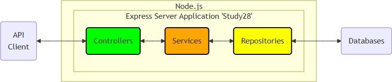

# Study28 README Contents

## Research on Express web framework and ten databases

Project sections:

1. [Business Logic](#-business-logic)
2. [Application Tests](#-application-tests)
3. [Docker Build and Curl Tests](#-docker-build-and-curl-tests)
4. [Local Build and Curl Tests](#-local-build-and-curl-tests)
5. [Web Browser Client](#-web-browser-client)

---

## ❶ Business Logic

 1.1. The diagrams.

- 🔸 Layered architecture diagrams
  - [Layer dependencies](https://github.com/k1729p/Study28/blob/main/docs/mermaid/layerDependenciesDiagram.md)
  - [Layer data flow](https://github.com/k1729p/Study28/blob/main/docs/mermaid/layerDataFlowDiagram.md)
- 🔸 Class diagrams
  - [Models](https://github.com/k1729p/Study28/blob/main/docs/mermaid/classDiagramModels.md)
  - [Controllers](https://github.com/k1729p/Study28/blob/main/docs/mermaid/classDiagramControllers.md)
  - [Services](https://github.com/k1729p/Study28/blob/main/docs/mermaid/classDiagramServices.md)
  - [Repositories](https://github.com/k1729p/Study28/blob/main/docs/mermaid/classDiagramRepositories.md)
- 🔸 Entity relationship diagrams
  - [Cassandra](https://github.com/k1729p/Study28/blob/main/docs/mermaid/entityRelationshipCassandra.md)
  - [Chroma](https://github.com/k1729p/Study28/blob/main/docs/mermaid/entityRelationshipChroma.md)
  - [Elasticsearch](https://github.com/k1729p/Study28/blob/main/docs/mermaid/entityRelationshipElasticsearch.md)
  - [MongoDB](https://github.com/k1729p/Study28/blob/main/docs/mermaid/entityRelationshipMongoDB.md)
  - [MySQL](https://github.com/k1729p/Study28/blob/main/docs/mermaid/entityRelationshipMySQL.md)
  - [Neo4j](https://github.com/k1729p/Study28/blob/main/docs/mermaid/flowchartNeo4jGraph.md)
  - [Oracle](https://github.com/k1729p/Study28/blob/main/docs/mermaid/entityRelationshipOracle.md)
  - [PostgreSQL](https://github.com/k1729p/Study28/blob/main/docs/mermaid/entityRelationshipPostgreSQL.md)
  - [SQL Server](https://github.com/k1729p/Study28/blob/main/docs/mermaid/entityRelationshipSQL-Server.md)
  - [Redis](https://github.com/k1729p/Study28/blob/main/docs/mermaid/flowchartRedis.md)
- 🔸 Sequence diagrams
  - Load initial data
  - [Create department](https://github.com/k1729p/Study28/blob/main/docs/mermaid/sequenceDiagram.md)
  - Read department by id
  - Update department by id
  - Delete department by id
  - Create employee
  - Read employee by id
  - Update employee by id
  - Delete employee by id
  - Transfer employees

 1.2. The data stores.

| Name | Type | Storage Abstraction | Query Language |
| :--- | :--- | :--- | :--- |
| [Cassandra][ds01] | [Wide-Column Store][ds11] | Table | CQL (Cassandra Query Language) |
| [Chroma][ds02] | [Vector Database][ds12] | Collection | Chroma API (Python/JS Client) |
| [Elasticsearch][ds03] | Search Engine / [Document Store][ds13] | Index / Document | Query DSL (JSON, built on Lucene) |
| [MongoDB][ds04] | [Document Store][ds13] | Collection | MQL (MongoDB Query Language) |
| [MySQL][ds05] | [Relational][ds15] | Table | SQL |
| [Neo4j][ds06] | [Graph Database][ds16] | Node / Relationship | Cypher |
| [Oracle][ds07] | [Relational][ds15] | Table | SQL / PL/SQL |
| [PostgreSQL][ds08] | [Relational][ds15] | Table | SQL |
| [Redis][ds09] | [Key-Value][ds19] / Cache | Hash / String | Redis Commands |
| [SQL Server][ds10] | [Relational][ds15] | Table | T-SQL |

[ds01]: <https://cassandra.apache.org/_/index.html> "Apache Cassandra"
[ds02]: <https://www.trychroma.com/> "Chroma"
[ds03]: <https://www.elastic.co/elasticsearch> "Elasticsearch"
[ds04]: <https://www.mongodb.com/products/platform/atlas-database> "MongoDB Atlas"
[ds05]: <https://www.mysql.com/> "MySQL"
[ds06]: <https://neo4j.com/product/neo4j-graph-database/> "Neo4j"
[ds07]: <https://www.oracle.com/database/free/> "Oracle AI Database 26ai"
[ds08]: <https://www.postgresql.org/> "PostgreSQL"
[ds09]: <https://redis.io/> "Redis"
[ds10]: <https://www.microsoft.com/en-us/sql-server> "Microsoft SQL Server"
[ds11]: <https://en.wikipedia.org/wiki/Wide-column_store> "Wide-Column Store"
[ds12]: <https://en.wikipedia.org/wiki/Vector_database> "Vector Database"
[ds13]: <https://en.wikipedia.org/wiki/Document-oriented_database> "Document-oriented database"
[ds15]: <https://en.wikipedia.org/wiki/Relational_database> "Relational database"
[ds16]: <https://en.wikipedia.org/wiki/Graph_database> "Graph database"
[ds19]: <https://en.wikipedia.org/wiki/Key%E2%80%93value_database> "Key–value database"

 1.3. The environment variables file '[.env](https://github.com/k1729p/Study28/blob/main/.env)'.
In this file are users and passwords for databases.

 1.4. The **TypeScript** sources are located in the directory [src](https://github.com/k1729p/Study28/blob/main/src).

🔹 [server.ts](https://github.com/k1729p/Study28/blob/main/src/server.ts)

🔹 'Controllers' section:

- directory [controllers](https://github.com/k1729p/Study28/blob/main/src/controllers)
  - DepartmentController
    [department.controller.ts](https://github.com/k1729p/Study28/blob/main/src/controllers/department.controller.ts)
  - EmployeeController
    [employee.controller.ts](https://github.com/k1729p/Study28/blob/main/src/controllers/employee.controller.ts)
  - InitializationController
    [initialization.controller.ts](https://github.com/k1729p/Study28/blob/main/src/controllers/initialization.controller.ts)
  - TransferController
    [transfer.controller.ts](https://github.com/k1729p/Study28/blob/main/src/controllers/transfer.controller.ts)

🔹 'Models' section:

- directory [models](https://github.com/k1729p/Study28/blob/main/src/models)
  - Department
    [department.ts](https://github.com/k1729p/Study28/blob/main/src/models/department.ts)
  - Employee
    [employee.ts](https://github.com/k1729p/Study28/blob/main/src/models/employee.ts)
  - Title
    [title.ts](https://github.com/k1729p/Study28/blob/main/src/models/title.ts)

🔹 'Services' section:

- directory [services](https://github.com/k1729p/Study28/blob/main/src/services)
  - DepartmentService
    [department.service.ts](https://github.com/k1729p/Study28/blob/main/src/services/department.service.ts)
  - EmployeeService
    [employee.service.ts](https://github.com/k1729p/Study28/blob/main/src/services/employee.service.ts)
  - InitializationService
    [initialization.service.ts](https://github.com/k1729p/Study28/blob/main/src/services/initialization.service.ts)
  - TransferService
    [transfer.service.ts](https://github.com/k1729p/Study28/blob/main/src/services/transfer.service.ts)

🔹 'Repositories' section:

- directory [repositories](https://github.com/k1729p/Study28/blob/main/src/repositories)
  - RepositoryLock
    [repository-lock.ts](https://github.com/k1729p/Study28/blob/main/src/repositories/repository-lock.ts)
- directory [repositories/cassandra](https://github.com/k1729p/Study28/blob/main/src/repositories/cassandra)
  - CassandraDepartmentRepository
    [cassandra.department.repository.ts](https://github.com/k1729p/Study28/blob/main/src/repositories/cassandra/cassandra.department.repository.ts)
  - CassandraEmployeeRepository
    [cassandra.employee.repository.ts](https://github.com/k1729p/Study28/blob/main/src/repositories/cassandra/cassandra.employee.repository.ts)
- directory [repositories/chroma](https://github.com/k1729p/Study28/blob/main/src/repositories/chroma)
  - ChromaDepartmentRepository
    [chroma.department.repository.ts](https://github.com/k1729p/Study28/blob/main/src/repositories/chroma/chroma.department.repository.ts)
  - ChromaEmployeeRepository
    [chroma.employee.repository.ts](https://github.com/k1729p/Study28/blob/main/src/repositories/chroma/chroma.employee.repository.ts)
- directory [repositories/elasticsearch](https://github.com/k1729p/Study28/blob/main/src/repositories/elasticsearch)
  - ElasticsearchDepartmentRepository
    [elasticsearch.department.repository.ts](https://github.com/k1729p/Study28/blob/main/src/repositories/elasticsearch/elasticsearch.department.repository.ts)
  - ElasticsearchEmployeeRepository
    [elasticsearch.employee.repository.ts](https://github.com/k1729p/Study28/blob/main/src/repositories/elasticsearch/elasticsearch.employee.repository.ts)
- directory [repositories/mongodb](https://github.com/k1729p/Study28/blob/main/src/repositories/mongodb)
  - MongoDbDepartmentRepository
    [mongodb.department.repository.ts](https://github.com/k1729p/Study28/blob/main/src/repositories/mongodb/mongodb.department.repository.ts)
  - MongoDbEmployeeRepository
    [mongodb.employee.repository.ts](https://github.com/k1729p/Study28/blob/main/src/repositories/mongodb/mongodb.employee.repository.ts)
- directory [repositories/mysql](https://github.com/k1729p/Study28/blob/main/src/repositories/mysql)
  - MySqlDepartmentRepository
    [mysql.department.repository.ts](https://github.com/k1729p/Study28/blob/main/src/repositories/mysql/mysql.department.repository.ts)
  - MySqlEmployeeRepository
    [mysql.employee.repository.ts](https://github.com/k1729p/Study28/blob/main/src/repositories/mysql/mysql.employee.repository.ts)
- directory [repositories/neo4j](https://github.com/k1729p/Study28/blob/main/src/repositories/neo4j)
  - Neo4jDepartmentRepository
    [neo4j.department.repository.ts](https://github.com/k1729p/Study28/blob/main/src/repositories/neo4j/neo4j.department.repository.ts)
  - Neo4jEmployeeRepository
    [neo4j.employee.repository.ts](https://github.com/k1729p/Study28/blob/main/src/repositories/neo4j/neo4j.employee.repository.ts)
- directory [repositories/oracle](https://github.com/k1729p/Study28/blob/main/src/repositories/oracle)
  - OracleDepartmentRepository
    [oracle.department.repository.ts](https://github.com/k1729p/Study28/blob/main/src/repositories/oracle/oracle.department.repository.ts)
  - OracleEmployeeRepository
    [oracle.employee.repository.ts](https://github.com/k1729p/Study28/blob/main/src/repositories/oracle/oracle.employee.repository.ts)
- directory [repositories/postgresql](https://github.com/k1729p/Study28/blob/main/src/repositories/postgresql)
  - PostgreSQLDepartmentRepository
    [postgresql.department.repository.ts](https://github.com/k1729p/Study28/blob/main/src/repositories/postgresql/postgresql.department.repository.ts)
  - PostgreSQLEmployeeRepository
    [postgresql.employee.repository.ts](https://github.com/k1729p/Study28/blob/main/src/repositories/postgresql/postgresql.employee.repository.ts)
- directory [repositories/redis](https://github.com/k1729p/Study28/blob/main/src/repositories/redis)
  - RedisDepartmentRepository
    [redis.department.repository.ts](https://github.com/k1729p/Study28/blob/main/src/repositories/redis/redis.department.repository.ts)
  - RedisEmployeeRepository
    [redis.employee.repository.ts](https://github.com/k1729p/Study28/blob/main/src/repositories/redis/redis.employee.repository.ts)
- directory [repositories/sql-server](https://github.com/k1729p/Study28/blob/main/src/repositories/sql-server)
  - SQLServerDepartmentRepository
    [sql-server.department.repository.ts](https://github.com/k1729p/Study28/blob/main/src/repositories/sql-server/sql-server.department.repository.ts)
  - SQLServerEmployeeRepository
    [sql-server.employee.repository.ts](https://github.com/k1729p/Study28/blob/main/src/repositories/sql-server/sql-server.employee.repository.ts)

 1.5. The **RepositoryLock** is an asynchronous read/write lock.

- Entire schema recreation and initialization process uses **exclusive lock**.
- Normal repository operations use **shared lock**.

This lock is implemented for Cassandra, Elasticsearch, MySql, and Oracle databases. \
This lock is not implemented for PostgreSQL and SQL Server databases, because it is not required.

[Back to the top of the page](#study28-readme-contents)

---

## ❷ Application Tests

Action: \
  \
  1. Use
  ["01 Vitest tests.bat"](https://github.com/k1729p/Study28/blob/main/0_batch/01%20Vitest%20tests.bat)
  to start application tests. \
 

 2.1. The testing architecture.

- Controller/Route Layer: Component/Integration tested using **Supertest** and **Vitest** Mocks.
- Service Layer: Unit tested using **Vitest** (business logic, validation, database calls).

[Back to the top of the page](#study28-readme-contents)

---

## ❸ Docker Build and Curl Tests

Action: \
  \
  1. Use
  ["02 Databases on Docker build and run.bat"](https://github.com/k1729p/Study28/blob/main/0_batch/02%20Databases%20on%20Docker%20build%20and%20run.bat)
  to build and start ten database containers. \
  2. Use
  ["03 Express on Docker build and run.bat"](https://github.com/k1729p/Study28/blob/main/0_batch/03%20Express%20on%20Docker%20build%20and%20run.bat)
  to build the image and start the container. \
  3. Use
  ["04 Docker reports menu.bat"](https://github.com/k1729p/Study28/blob/main/0_batch/04%20Docker%20reports%20menu.bat)
  to read Docker reports. \
  4. Use
  ["05 CURL on Docker.bat"](https://github.com/k1729p/Study28/blob/main/0_batch/05%20CURL%20on%20Docker.bat)
  to run curl tests. \
 

 3.1. **Docker** images are built using the following files.

Docker scripts:

- [Dockerfile](https://github.com/k1729p/Study28/blob/main/docker-config/Dockerfile)
- [compose.yaml](https://github.com/k1729p/Study28/blob/main/docker-config/compose.yaml)
  - [cassandra.yaml](https://github.com/k1729p/Study28/blob/main/docker-config/includes/cassandra.yaml)
  - [chroma.yaml](https://github.com/k1729p/Study28/blob/main/docker-config/includes/chroma.yaml)
  - [elasticsearch.yaml](https://github.com/k1729p/Study28/blob/main/docker-config/includes/elasticsearch.yaml)
  - [mongodb.yaml](https://github.com/k1729p/Study28/blob/main/docker-config/includes/mongodb.yaml)
  - [mysql.yaml](https://github.com/k1729p/Study28/blob/main/docker-config/includes/mysql.yaml)
  - [neo4j.yaml](https://github.com/k1729p/Study28/blob/main/docker-config/includes/neo4j.yaml)
  - [oracle.yaml](https://github.com/k1729p/Study28/blob/main/docker-config/includes/oracle.yaml)
  - [postgresql.yaml](https://github.com/k1729p/Study28/blob/main/docker-config/includes/postgresql.yaml)
  - [redis.yaml](https://github.com/k1729p/Study28/blob/main/docker-config/includes/redis.yaml)
  - [sql-server.yaml](https://github.com/k1729p/Study28/blob/main/docker-config/includes/sql-server.yaml)

 3.2. The [screenshot](images/ScreenshotCurlOnDockerInitDB.png)
of the console log from the run of the batch script "CURL_init_DB.bat" with **PostgreSQL** selected.

 3.3. The [screenshot](images/ScreenshotCurlOnDockerCRUD.png)
of the console log from the run of the batch script "CURL_CRUD.bat" with **PostgreSQL** selected.

[Back to the top of the page](#study28-readme-contents)

---

## ❹ Local Build and Curl Tests

Action: \
  \
  1. Use
  ["06 Express on local build and run.bat"](https://github.com/k1729p/Study28/blob/main/0_batch/06%20Express%20on%20local%20build%20and%20run.bat)
  to build and start the local application. \
  2. Use
  ["07 CURL on local.bat"](https://github.com/k1729p/Study28/blob/main/0_batch/07%20CURL%20on%20local.bat)
  to run curl tests. \
 

[Back to the top of the page](#study28-readme-contents)

---

## ❺ Web Browser Client

Action: \
  \
  Open the file
  [Links.html](https://github.com/k1729p/Study28/blob/main/0_batch/Links.html)
  in a web browser. \
 

 5.1. The GitHub preview in a browser of the page
  [Links](https://htmlpreview.github.io/?https://github.com/k1729p/Study28/blob/main/0_batch/Links.html).

[Back to the top of the page](#study28-readme-contents)

---

## Links

| Resource | Description |
| :--- | :--- |
| [Node.js](https://nodejs.org/en/) | JavaScript runtime environment |
| [Express](https://expressjs.com/) | Web framework for Node.js |
| [Vitest](https://vitest.dev/) | Testing framework |
| [Cassandra glossary](https://cassandra.apache.org/_/glossary.html) | |
| [Chroma Data Model](https://docs.trychroma.com/reference/architecture/overview#chroma-data-model) | |
| [Elastic glossary](https://www.elastic.co/docs/reference/glossary) | |
| [Neo4j Cypher cheat sheet](https://neo4j.com/docs/cypher-cheat-sheet/) | Cypher is Neo4j’s graph query language |
| [Neo4j Cypher manual](https://neo4j.com/docs/cypher-manual/) | |

---

## Info

**A**. Database Transaction Support for Data Definition Language in Relational Databases.

| Database | Transactional DDL Support | Implicit Commit Behavior |
| --- | --- | --- |
| **MySQL** | **No** | Executing DDL causes an **implicit commit** of any open transaction and cannot be rolled back. |
| **Oracle** | **No** | Automatically issues an implicit `COMMIT` right before and right after any DDL statement. |
| **PostgreSQL** | **Yes** | DDL stays inside standard `BEGIN ... COMMIT` blocks. If anything fails, everything rolls back seamlessly. |
| **SQL Server** | **Yes** | Standard `BEGIN TRANSACTION` covers `CREATE TABLE`, `DROP TABLE`, etc. |

**B**. Comparison of "Startup Health Checks".

| **Database** | **Driver** | **Behavior of createPool / connect** | **Recommended Health Check Logic** |
| :--- | :--- | :--- | :--- |
| MySQL | mysql2 | Lazy: Doesn't check connection until first query. | Required: Call pool.getConnection() then release(). |
| PostgreSQL | pg | Lazy: Pool object is created synchronously. | Required: Call pool.connect() then release(). |
| Oracle | oracledb | Eager: Fails if it can't open initial connections. | Optional: Call pool.getConnection() then close(). |
| SQL Server | mssql | Eager: .connect() fails if server is unreachable. | Already Done: The .connect() call is the check. |

**C**. TVP design pattern.
The Table-Valued Parameter design pattern and programming feature allows you to pass entire tables of data as a single parameter into stored procedures or functions, rather than sending rows one by one or parsing XML/JSON strings.
