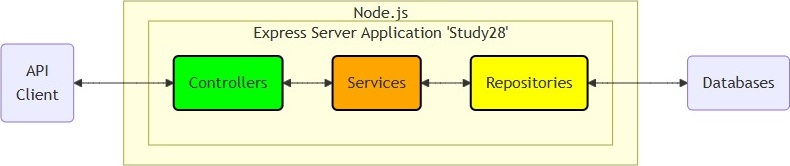

# Study28 README Contents

## Research on the Express Web Framework and Databases

| [Cassandra] | [Chroma] | [Elasticsearch] | [MongoDB] | [MySQL] |
| :--- | :--- | :--- | :--- | :--- |
| **[Neo4j]** | **[Oracle]** | **[PostgreSQL]** | **[Redis]** | **[SQL Server]** |
|  |  |  |  |  |

[Cassandra]: <https://cassandra.apache.org/_/index.html> "Apache Cassandra"
[Chroma]: <https://www.trychroma.com/> "Chroma"
[Elasticsearch]: <https://www.elastic.co/elasticsearch> "Elasticsearch"
[MongoDB]: <https://www.mongodb.com/products/platform/atlas-database> "MongoDB Atlas"
[MySQL]: <https://www.mysql.com/> "Oracle MySQL"
[Neo4j]: <https://neo4j.com/product/neo4j-graph-database/> "Neo4j"
[Oracle]: <https://www.oracle.com/database/free/> "Oracle AI Database 26ai"
[PostgreSQL]: <https://www.postgresql.org/> "PostgreSQL"
[Redis]: <https://redis.io/> "Redis"
[SQL Server]: <https://www.microsoft.com/en-us/sql-server> "Microsoft SQL Server"

Project sections:

1. [Business Logic](#-business-logic)
2. [Application Tests](#-application-tests)
3. [Docker Build and Curl Tests](#-docker-build-and-curl-tests)
4. [Local Build and Curl Tests](#-local-build-and-curl-tests)
5. [Web Browser Client](#-web-browser-client)

---

## ❶ Business Logic

 1.1. The layered architecture diagrams

| | |
| :--- | :--- |
| [Layer dependencies] | [Layer data flow] |

[Layer dependencies]: <https://github.com/k1729p/Study28/blob/main/docs/mermaid/layerDependenciesDiagram.md>
[Layer data flow]: <https://github.com/k1729p/Study28/blob/main/docs/mermaid/layerDataFlowDiagram.md>

 1.2. The class diagrams

| | | |
| :--- | :--- | :--- |
| [Models] | | |
| [Controllers] | [Services] | [Repositories] |

[Models]: <https://github.com/k1729p/Study28/blob/main/docs/mermaid/classDiagramModels.md>
[Controllers]: <https://github.com/k1729p/Study28/blob/main/docs/mermaid/classDiagramControllers.md>
[Services]: <https://github.com/k1729p/Study28/blob/main/docs/mermaid/classDiagramServices.md>
[Repositories]: <https://github.com/k1729p/Study28/blob/main/docs/mermaid/classDiagramRepositories.md>

 1.3. The entity-relationship diagrams (flowcharts for Neo4j and Redis).

| | | | | |
| :--- | :--- | :--- | :--- | :--- |
| [Cassandra][dgm01] | [Chroma][dgm02] | [Elasticsearch][dgm03] | [MongoDB][dgm04] | [MySQL][dgm05] |
| [Neo4j][dgm06] | [Oracle][dgm07] | [PostgreSQL][dgm08] | [Redis][dgm09] | [SQL Server][dgm10] |

[dgm01]: <https://github.com/k1729p/Study28/blob/main/docs/mermaid/entityRelationshipCassandra.md>
[dgm02]: <https://github.com/k1729p/Study28/blob/main/docs/mermaid/entityRelationshipChroma.md>
[dgm03]: <https://github.com/k1729p/Study28/blob/main/docs/mermaid/entityRelationshipElasticsearch.md>
[dgm04]: <https://github.com/k1729p/Study28/blob/main/docs/mermaid/entityRelationshipMongoDB.md>
[dgm05]: <https://github.com/k1729p/Study28/blob/main/docs/mermaid/entityRelationshipMySQL.md>
[dgm06]: <https://github.com/k1729p/Study28/blob/main/docs/mermaid/flowchartNeo4jGraph.md>
[dgm07]: <https://github.com/k1729p/Study28/blob/main/docs/mermaid/entityRelationshipOracle.md>
[dgm08]: <https://github.com/k1729p/Study28/blob/main/docs/mermaid/entityRelationshipPostgreSQL.md>
[dgm09]: <https://github.com/k1729p/Study28/blob/main/docs/mermaid/flowchartRedis.md>
[dgm10]: <https://github.com/k1729p/Study28/blob/main/docs/mermaid/entityRelationshipSQL-Server.md>

 1.4. The sequence diagrams with process logic descriptions.

| | | | |
| :--- | :--- | :--- | :--- |
| [Load initial data] | | | |
| [Create department] | [Read department by ID] | [Update department by ID] | [Delete department by ID] |
| [Create employee] | [Read employee by ID] | [Update employee by ID] | [Delete employee by ID] |
| [Transfer employees] | | | |

[Load initial data]: <https://github.com/k1729p/Study28/blob/main/docs/mermaid/sequenceDiagramLoadInitialData.md>
[Create department]: <https://github.com/k1729p/Study28/blob/main/docs/mermaid/sequenceDiagramCreateDepartment.md>
[Read department by ID]: <https://github.com/k1729p/Study28/blob/main/docs/mermaid/sequenceDiagramReadDepartment.md>
[Update department by ID]: <https://github.com/k1729p/Study28/blob/main/docs/mermaid/sequenceDiagramUpdateDepartment.md>
[Delete department by ID]: <https://github.com/k1729p/Study28/blob/main/docs/mermaid/sequenceDiagramDeleteDepartment.md>
[Create employee]: <https://github.com/k1729p/Study28/blob/main/docs/mermaid/sequenceDiagramCreateEmployee.md>
[Read employee by ID]: <https://github.com/k1729p/Study28/blob/main/docs/mermaid/sequenceDiagramReadEmployee.md>
[Update employee by ID]: <https://github.com/k1729p/Study28/blob/main/docs/mermaid/sequenceDiagramUpdateEmployee.md>
[Delete employee by ID]: <https://github.com/k1729p/Study28/blob/main/docs/mermaid/sequenceDiagramDeleteEmployee.md>
[Transfer employees]: <https://github.com/k1729p/Study28/blob/main/docs/mermaid/sequenceDiagramTransferEmployees.md>

 1.5. The data stores summary.

| Name | Type | Storage Abstraction | Query Language |
| :--- | :--- | :--- | :--- |
| [Cassandra] | [Wide-Column Store] | Table | CQL[^1] |
| [Chroma] | [Vector Database] | Collection | Chroma API[^2] |
| [Elasticsearch] | Search Engine / [Document Store] | Index / Document | Query DSL[^3] |
| [MongoDB] | [Document Store] | Collection | MQL[^4] |
| [MySQL] | [Relational] | Table | SQL |
| [Neo4j] | [Graph Database] | Node / Relationship | Cypher |
| [Oracle] | [Relational] | Table | SQL / PL/SQL |
| [PostgreSQL] | [Relational] | Table | SQL |
| [Redis] | [Key-Value] / Cache | Hash / String | Redis Commands |
| [SQL Server] | [Relational] | Table | T-SQL |

[Wide-Column Store]: <https://en.wikipedia.org/wiki/Wide-column_store>
[Vector Database]: <https://en.wikipedia.org/wiki/Vector_database>
[Document Store]: <https://en.wikipedia.org/wiki/Document-oriented_database> "Document-oriented database"
[Relational]: <https://en.wikipedia.org/wiki/Relational_database> "Relational database"
[Graph Database]: <https://en.wikipedia.org/wiki/Graph_database>
[Key-Value]: <https://en.wikipedia.org/wiki/Key%E2%80%93value_database> "Key–value database"
[^1]: Cassandra Query Language
[^2]: Accessed through the Python and JavaScript clients
[^3]: Domain-Specific Language, JSON-based, built on Lucene
[^4]: MongoDB Query Language

 1.6. The environment variables file [".env"](https://github.com/k1729p/Study28/blob/main/.env).
This file contains the user names and passwords for the databases.

 1.7. The **TypeScript** sources are located in the directory [src](https://github.com/k1729p/Study28/blob/main/src).

🔹 [server.ts](https://github.com/k1729p/Study28/blob/main/src/server.ts)

🔹 'Controllers' section:

- directory [controllers](https://github.com/k1729p/Study28/blob/main/src/controllers)
  - DepartmentController
    [department.controller.ts](https://github.com/k1729p/Study28/blob/main/src/controllers/department.controller.ts)
  - EmployeeController
    [employee.controller.ts](https://github.com/k1729p/Study28/blob/main/src/controllers/employee.controller.ts)
  - InitializationController
    [initialization.controller.ts](https://github.com/k1729p/Study28/blob/main/src/controllers/initialization.controller.ts)
  - TransferController
    [transfer.controller.ts](https://github.com/k1729p/Study28/blob/main/src/controllers/transfer.controller.ts)

🔹 'Models' section:

- directory [models](https://github.com/k1729p/Study28/blob/main/src/models)
  - Department
    [department.ts](https://github.com/k1729p/Study28/blob/main/src/models/department.ts)
  - Employee
    [employee.ts](https://github.com/k1729p/Study28/blob/main/src/models/employee.ts)
  - Title
    [title.ts](https://github.com/k1729p/Study28/blob/main/src/models/title.ts)

🔹 'Services' section:

- directory [services](https://github.com/k1729p/Study28/blob/main/src/services)
  - DepartmentService
    [department.service.ts](https://github.com/k1729p/Study28/blob/main/src/services/department.service.ts)
  - EmployeeService
    [employee.service.ts](https://github.com/k1729p/Study28/blob/main/src/services/employee.service.ts)
  - InitializationService
    [initialization.service.ts](https://github.com/k1729p/Study28/blob/main/src/services/initialization.service.ts)
  - TransferService
    [transfer.service.ts](https://github.com/k1729p/Study28/blob/main/src/services/transfer.service.ts)

🔹 'Repositories' section:

- directory [repositories](https://github.com/k1729p/Study28/blob/main/src/repositories)
  - RepositoryLock
    [repository-lock.ts](https://github.com/k1729p/Study28/blob/main/src/repositories/repository-lock.ts)
- directory [repositories/cassandra](https://github.com/k1729p/Study28/blob/main/src/repositories/cassandra)
  - CassandraDepartmentRepository
    [cassandra.department.repository.ts](https://github.com/k1729p/Study28/blob/main/src/repositories/cassandra/cassandra.department.repository.ts)
  - CassandraEmployeeRepository
    [cassandra.employee.repository.ts](https://github.com/k1729p/Study28/blob/main/src/repositories/cassandra/cassandra.employee.repository.ts)
- directory [repositories/chroma](https://github.com/k1729p/Study28/blob/main/src/repositories/chroma)
  - ChromaDepartmentRepository
    [chroma.department.repository.ts](https://github.com/k1729p/Study28/blob/main/src/repositories/chroma/chroma.department.repository.ts)
  - ChromaEmployeeRepository
    [chroma.employee.repository.ts](https://github.com/k1729p/Study28/blob/main/src/repositories/chroma/chroma.employee.repository.ts)
- directory [repositories/elasticsearch](https://github.com/k1729p/Study28/blob/main/src/repositories/elasticsearch)
  - ElasticsearchDepartmentRepository
    [elasticsearch.department.repository.ts](https://github.com/k1729p/Study28/blob/main/src/repositories/elasticsearch/elasticsearch.department.repository.ts)
  - ElasticsearchEmployeeRepository
    [elasticsearch.employee.repository.ts](https://github.com/k1729p/Study28/blob/main/src/repositories/elasticsearch/elasticsearch.employee.repository.ts)
- directory [repositories/mongodb](https://github.com/k1729p/Study28/blob/main/src/repositories/mongodb)
  - MongoDbDepartmentRepository
    [mongodb.department.repository.ts](https://github.com/k1729p/Study28/blob/main/src/repositories/mongodb/mongodb.department.repository.ts)
  - MongoDbEmployeeRepository
    [mongodb.employee.repository.ts](https://github.com/k1729p/Study28/blob/main/src/repositories/mongodb/mongodb.employee.repository.ts)
- directory [repositories/mysql](https://github.com/k1729p/Study28/blob/main/src/repositories/mysql)
  - MySqlDepartmentRepository
    [mysql.department.repository.ts](https://github.com/k1729p/Study28/blob/main/src/repositories/mysql/mysql.department.repository.ts)
  - MySqlEmployeeRepository
    [mysql.employee.repository.ts](https://github.com/k1729p/Study28/blob/main/src/repositories/mysql/mysql.employee.repository.ts)
- directory [repositories/neo4j](https://github.com/k1729p/Study28/blob/main/src/repositories/neo4j)
  - Neo4jDepartmentRepository
    [neo4j.department.repository.ts](https://github.com/k1729p/Study28/blob/main/src/repositories/neo4j/neo4j.department.repository.ts)
  - Neo4jEmployeeRepository
    [neo4j.employee.repository.ts](https://github.com/k1729p/Study28/blob/main/src/repositories/neo4j/neo4j.employee.repository.ts)
- directory [repositories/oracle](https://github.com/k1729p/Study28/blob/main/src/repositories/oracle)
  - OracleDepartmentRepository
    [oracle.department.repository.ts](https://github.com/k1729p/Study28/blob/main/src/repositories/oracle/oracle.department.repository.ts)
  - OracleEmployeeRepository
    [oracle.employee.repository.ts](https://github.com/k1729p/Study28/blob/main/src/repositories/oracle/oracle.employee.repository.ts)
- directory [repositories/postgresql](https://github.com/k1729p/Study28/blob/main/src/repositories/postgresql)
  - PostgreSqlDepartmentRepository
    [postgresql.department.repository.ts](https://github.com/k1729p/Study28/blob/main/src/repositories/postgresql/postgresql.department.repository.ts)
  - PostgreSqlEmployeeRepository
    [postgresql.employee.repository.ts](https://github.com/k1729p/Study28/blob/main/src/repositories/postgresql/postgresql.employee.repository.ts)
- directory [repositories/redis](https://github.com/k1729p/Study28/blob/main/src/repositories/redis)
  - RedisDepartmentRepository
    [redis.department.repository.ts](https://github.com/k1729p/Study28/blob/main/src/repositories/redis/redis.department.repository.ts)
  - RedisEmployeeRepository
    [redis.employee.repository.ts](https://github.com/k1729p/Study28/blob/main/src/repositories/redis/redis.employee.repository.ts)
- directory [repositories/sql-server](https://github.com/k1729p/Study28/blob/main/src/repositories/sql-server)
  - SqlServerDepartmentRepository
    [sql-server.department.repository.ts](https://github.com/k1729p/Study28/blob/main/src/repositories/sql-server/sql-server.department.repository.ts)
  - SqlServerEmployeeRepository
    [sql-server.employee.repository.ts](https://github.com/k1729p/Study28/blob/main/src/repositories/sql-server/sql-server.employee.repository.ts)

 1.8. The **RepositoryLock** is an asynchronous read/write lock.

- The entire schema recreation and initialization process uses an **exclusive lock**.
- Normal repository operations use a **shared lock**.

This lock is implemented for the Cassandra, Elasticsearch, MySQL, and Oracle databases. \
This lock is not implemented for the PostgreSQL and SQL Server databases, because they do not require it.

[Back to the top of the page](#study28-readme-contents)

---

## ❷ Application Tests

Action: \
  \
  1. Use
  ["01 Vitest tests.bat"](https://github.com/k1729p/Study28/blob/main/0_batch/01%20Vitest%20tests.bat)
  to start the application tests. \
 

 2.1. The testing architecture.

- Controller/Route layer: component and integration tests using **Supertest** and **Vitest** mocks.
- Service layer: unit tests using **Vitest** (business logic, validation, and database calls).

 2.2. The application tests [console log](logs/Vitest_tests_console_log.txt). A total of 844 tests were run, and all of them passed.

[Back to the top of the page](#study28-readme-contents)

---

## ❸ Docker Build and Curl Tests

Action: \
  \
  1. Use
  ["02 Databases on Docker build and run.bat"](https://github.com/k1729p/Study28/blob/main/0_batch/02%20Databases%20on%20Docker%20build%20and%20run.bat)
  to build and start the ten database containers. \
  2. Use
  ["03 Express on Docker build and run.bat"](https://github.com/k1729p/Study28/blob/main/0_batch/03%20Express%20on%20Docker%20build%20and%20run.bat)
  to build the Docker image and start the Express container. \
  3. Use
  ["04 Docker reports menu.bat"](https://github.com/k1729p/Study28/blob/main/0_batch/04%20Docker%20reports%20menu.bat)
  to view the Docker reports. \
  4. Use
  ["05 CURL on Docker.bat"](https://github.com/k1729p/Study28/blob/main/0_batch/05%20CURL%20on%20Docker.bat)
  to run the curl tests. \
 

 3.1. **Docker** configuration files:

[Dockerfile](https://github.com/k1729p/Study28/blob/main/docker-config/Dockerfile) \
[docker-compose.yaml](https://github.com/k1729p/Study28/blob/main/docker-config/docker-compose.yaml) \
[docker-compose-databases.yaml](https://github.com/k1729p/Study28/blob/main/docker-config/docker-compose-databases.yaml)

Files included in "docker-compose-databases.yaml"

- [cassandra.yaml](https://github.com/k1729p/Study28/blob/main/docker-config/includes/cassandra.yaml)
- [chroma.yaml](https://github.com/k1729p/Study28/blob/main/docker-config/includes/chroma.yaml)
- [elasticsearch.yaml](https://github.com/k1729p/Study28/blob/main/docker-config/includes/elasticsearch.yaml)
- [mongodb.yaml](https://github.com/k1729p/Study28/blob/main/docker-config/includes/mongodb.yaml)
- [mysql.yaml](https://github.com/k1729p/Study28/blob/main/docker-config/includes/mysql.yaml)
- [neo4j.yaml](https://github.com/k1729p/Study28/blob/main/docker-config/includes/neo4j.yaml)
- [oracle.yaml](https://github.com/k1729p/Study28/blob/main/docker-config/includes/oracle.yaml)
- [postgresql.yaml](https://github.com/k1729p/Study28/blob/main/docker-config/includes/postgresql.yaml)
- [redis.yaml](https://github.com/k1729p/Study28/blob/main/docker-config/includes/redis.yaml)
- [sql-server.yaml](https://github.com/k1729p/Study28/blob/main/docker-config/includes/sql-server.yaml)

 3.2. **Curl** test results.

- The [screenshot](images/ScreenshotCurlOnDockerInitDB.png) from running the script
  ["CURL_init_DB.bat"](https://github.com/k1729p/Study28/blob/main/0_batch/scripts/CURL_init_DB.bat) with **PostgreSQL** selected.
- The [screenshot](images/ScreenshotCurlOnDockerCRUD.png) from running the script
  ["CURL_CRUD.bat"](https://github.com/k1729p/Study28/blob/main/0_batch/scripts/CURL_CRUD.bat) with **PostgreSQL** selected.

[Back to the top of the page](#study28-readme-contents)

---

## ❹ Local Build and Curl Tests

Action: \
  \
  1. Use
  ["06 Express on local build and run.bat"](https://github.com/k1729p/Study28/blob/main/0_batch/06%20Express%20on%20local%20build%20and%20run.bat)
  to build and start the local application. \
  2. Use
  ["07 CURL on local.bat"](https://github.com/k1729p/Study28/blob/main/0_batch/07%20CURL%20on%20local.bat)
  to run the curl tests. \
 

[Back to the top of the page](#study28-readme-contents)

---

## ❺ Web Browser Client

Action: \
  \
  Open the file
  [Links.html](https://github.com/k1729p/Study28/blob/main/0_batch/Links.html)
  in a web browser. \
 

 5.1. The GitHub HTML preview of the page
  [Links](https://htmlpreview.github.io/?https://github.com/k1729p/Study28/blob/main/0_batch/Links.html) in a web browser.

[Back to the top of the page](#study28-readme-contents)

---

## Links

| Resource | Description |
| :--- | :--- |
| [Node.js](https://nodejs.org/en/) | JavaScript runtime environment |
| [Express](https://expressjs.com/) | Web framework for Node.js |
| [Vitest](https://vitest.dev/) | Testing framework |
| [Cassandra glossary](https://cassandra.apache.org/_/glossary.html) | Glossary of Cassandra terms |
| [Chroma Data Model](https://docs.trychroma.com/reference/architecture/overview#chroma-data-model) | Description of the Chroma data model |
| [Elastic glossary](https://www.elastic.co/docs/reference/glossary) | Glossary of Elastic terms |
| [Neo4j Cypher cheat sheet](https://neo4j.com/docs/cypher-cheat-sheet/) | Quick reference for Cypher, the Neo4j graph query language |
| [Neo4j Cypher manual](https://neo4j.com/docs/cypher-manual/) | Reference manual for the Cypher query language |

---

## Info

**A**. Transactional support for Data Definition Language (DDL) in relational databases.

| Database | Transactional DDL Support | Transaction Behavior |
| :--- | :--- | :--- |
| MySQL | No | Executing DDL causes an implicit commit of any open transaction, and the DDL statement cannot be rolled back. |
| Oracle | No | Implicitly issues a `COMMIT` immediately before and immediately after every DDL statement. |
| PostgreSQL | Yes | DDL statements run inside standard `BEGIN ... COMMIT` blocks. If any statement fails, the whole transaction is rolled back. |
| SQL Server | Yes | A standard `BEGIN TRANSACTION` covers statements such as `CREATE TABLE` and `DROP TABLE`. |

**B**. Comparison of startup health checks.

| Database | Driver | Behavior of `createPool` / `connect` | Recommended Health Check Logic |
| :--- | :--- | :--- | :--- |
| MySQL | `mysql2` | Lazy: Does not check the connection until the first query. | Required: Call `pool.getConnection()`, then `release()`. |
| PostgreSQL | `pg` | Lazy: The pool object is created synchronously without opening a connection. | Required: Call `pool.connect()`, then `release()`. |
| Oracle | `oracledb` | Eager: Fails if it cannot open the initial connections. | Optional: Call `pool.getConnection()`, then `close()`. |
| SQL Server | `mssql` | Eager: `.connect()` fails if the server is unreachable. | Already done: The `.connect()` call is the check. |

**C**. The sequence diagrams use the **Boundary–Control–Entity (BCE)** pattern.

| Stereotype | Represents |
| :--- | :--- |
| **Actor** | An external party outside the system (a human user or an external client/system) |
| **Boundary** | The system's own interface layer, which an external actor touches first (for example, a UI screen or an API endpoint/controller) |
| **Control** | The orchestration/business-logic layer that coordinates the use case |
| **Entity** | Persistent domain data (a model or the data store itself) |

**D**. Table-Valued Parameter (TVP) design pattern.

The **Table-Valued Parameter (TVP)** design pattern and programming feature of SQL Server allows passing an entire table of data as a single parameter into a stored procedure or function, instead of sending rows one by one or parsing XML/JSON strings.
