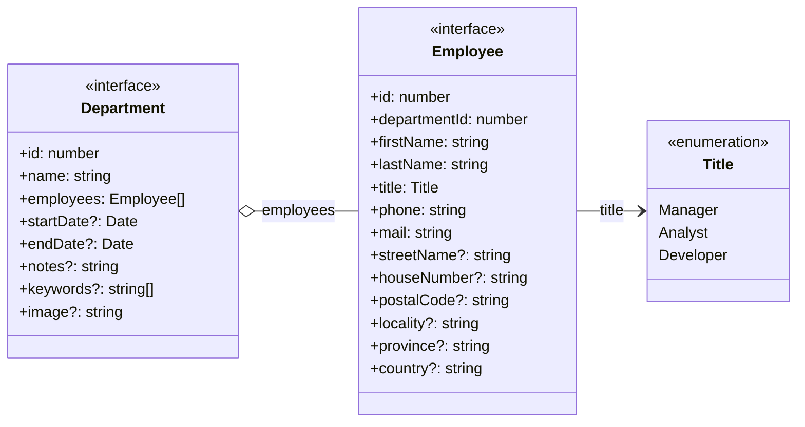

# Models Class Diagram

```mermaid
classDiagram
direction LR
class Department {
  <<interface>>
  +id: number
  +name: string
  +employees: Employee[]
  +startDate?: Date
  +endDate?: Date
  +notes?: string
  +keywords?: string[]
  +image?: string
}
class Employee {
  <<interface>>
  +id: number
  +departmentId: number
  +firstName: string
  +lastName: string
  +title: Title
  +phone: string
  +mail: string
  +streetName?: string
  +houseNumber?: string
  +postalCode?: string
  +locality?: string
  +province?: string
  +country?: string
}
class Title {
  <<enumeration>>
  Manager
  Analyst
  Developer
}
Department o-- Employee  : employees
Employee --> Title : title
```

---
