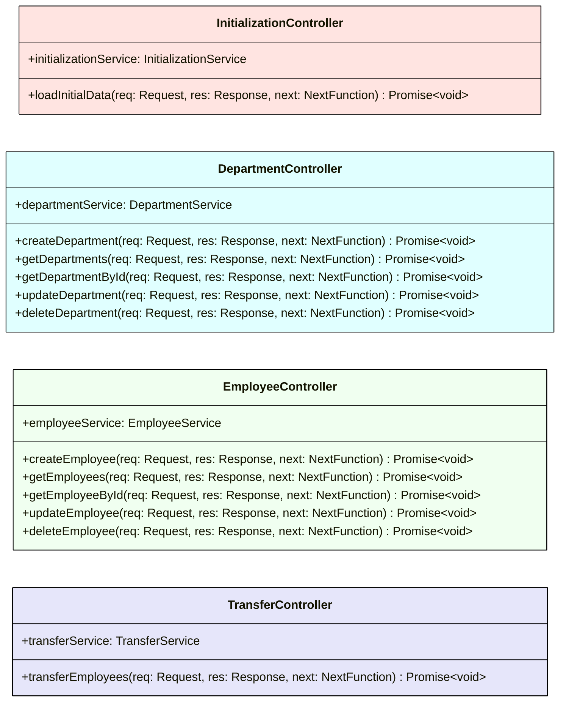

# Controllers Class Diagram

```mermaid
classDiagram
  direction LR
  class InitializationController:::mistyrose {
    +initializationService: InitializationService
    +loadInitialData(req: Request, res: Response, next: NextFunction) Promise~void~
  }

  class DepartmentController:::lightcyan {
    +departmentService: DepartmentService
    +createDepartment(req: Request, res: Response, next: NextFunction) Promise~void~
    +getDepartments(req: Request, res: Response, next: NextFunction) Promise~void~
    +getDepartmentById(req: Request, res: Response, next: NextFunction) Promise~void~
    +updateDepartment(req: Request, res: Response, next: NextFunction) Promise~void~
    +deleteDepartment(req: Request, res: Response, next: NextFunction) Promise~void~
  }

  class EmployeeController:::honeydew {
    +employeeService: EmployeeService
    +createEmployee(req: Request, res: Response, next: NextFunction) Promise~void~
    +getEmployees(req: Request, res: Response, next: NextFunction) Promise~void~
    +getEmployeeById(req: Request, res: Response, next: NextFunction) Promise~void~
    +updateEmployee(req: Request, res: Response, next: NextFunction) Promise~void~
    +deleteEmployee(req: Request, res: Response, next: NextFunction) Promise~void~
  }

  class TransferController:::lavender {
    +transferService: TransferService
    +transferEmployees(req: Request, res: Response, next: NextFunction) Promise~void~
  }
%% Styles
  classDef honeydew fill:honeydew,stroke:black,stroke-width:1px
  classDef lavender fill:lavender,stroke:black,stroke-width:1px
  classDef lightcyan fill:lightcyan,stroke:black,stroke-width:1px
  classDef mistyrose fill:mistyrose,stroke:black,stroke-width:1px
```

---
