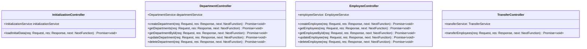

# Controllers Class Diagram

```mermaid
classDiagram
  class InitializationController {
    +InitializationService initializationService
    +loadInitialData(req: Request, res: Response, next: NextFunction) Promise~void~
  }
  class DepartmentController {
    +DepartmentService departmentService
    +createDepartment(req: Request, res: Response, next: NextFunction) Promise~void~
    +getDepartments(req: Request, res: Response, next: NextFunction) Promise~void~
    +getDepartmentById(req: Request, res: Response, next: NextFunction) Promise~void~
    +updateDepartment(req: Request, res: Response, next: NextFunction) Promise~void~
    +deleteDepartment(req: Request, res: Response, next: NextFunction) Promise~void~
  }
  class EmployeeController {
    +employeeService: EmployeeService
    +createEmployee(req: Request, res: Response, next: NextFunction) Promise~void~
    +getEmployees(req: Request, res: Response, next: NextFunction) Promise~void~
    +getEmployeeById(req: Request, res: Response, next: NextFunction) Promise~void~
    +updateEmployee(req: Request, res: Response, next: NextFunction) Promise~void~
    +deleteEmployee(req: Request, res: Response, next: NextFunction) Promise~void~
  }
  class TransferController {
    +transferService: TransferService
    +transferEmployees(req: Request, res: Response, next: NextFunction) Promise~void~
  }
```

---
