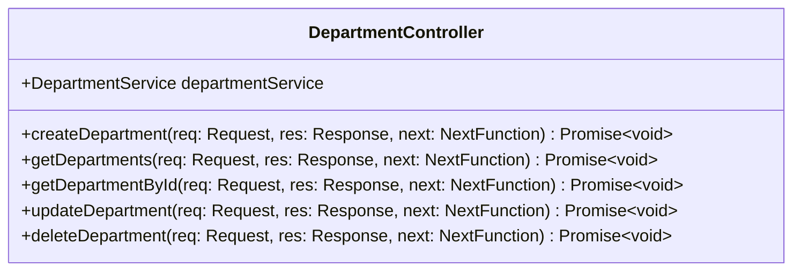

# Department Controller Class Diagram

```mermaid
classDiagram
  class DepartmentController {
    +DepartmentService departmentService
    +createDepartment(req: Request, res: Response, next: NextFunction) Promise~void~
    +getDepartments(req: Request, res: Response, next: NextFunction) Promise~void~
    +getDepartmentById(req: Request, res: Response, next: NextFunction) Promise~void~
    +updateDepartment(req: Request, res: Response, next: NextFunction) Promise~void~
    +deleteDepartment(req: Request, res: Response, next: NextFunction) Promise~void~
  }
```

---
