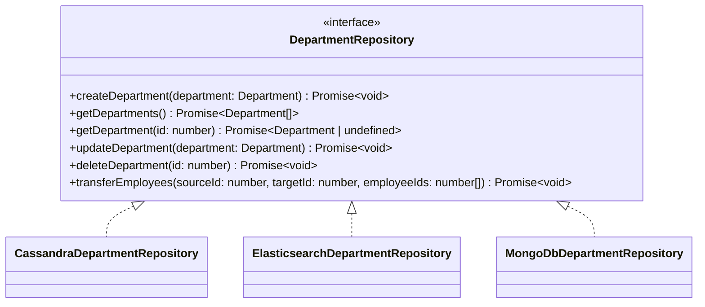

# Department Repository Class Diagram

```mermaid
classDiagram
direction TD
  class DepartmentRepository {
    <<interface>>
    +createDepartment(department: Department) Promise~void~
    +getDepartments() Promise~Department[]~
    +getDepartment(id: number) Promise~Department | undefined~
    +updateDepartment(department: Department) Promise~void~
    +deleteDepartment(id: number) Promise~void~
    +transferEmployees(sourceId: number, targetId: number, employeeIds: number[]) Promise~void~
  }

  class CassandraDepartmentRepository {
  }

  class ElasticsearchDepartmentRepository {
  }

  class MongoDbDepartmentRepository {
  }

  DepartmentRepository <|.. CassandraDepartmentRepository
  DepartmentRepository <|.. ElasticsearchDepartmentRepository
  DepartmentRepository <|.. MongoDbDepartmentRepository
```

---
