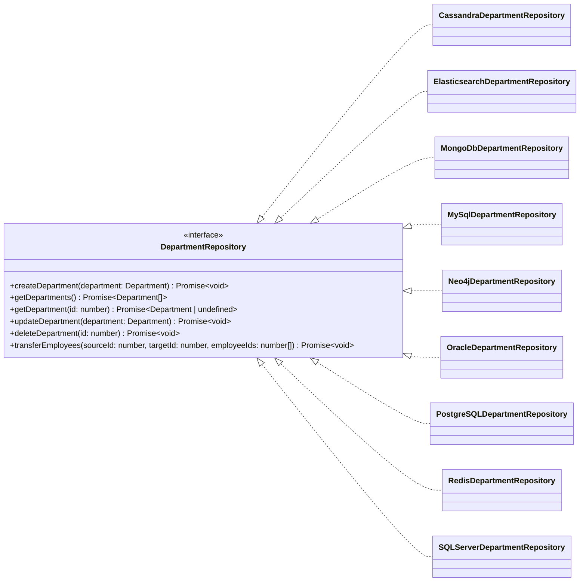

# Department Repository Class Diagram

DepartmentRepository: The core interface defining the contract for department management, including CRUD operations and employee transfers.

```mermaid
classDiagram
direction LR
  class DepartmentRepository {
    <<interface>>
    +createDepartment(department: Department) Promise~void~
    +getDepartments() Promise~Department[]~
    +getDepartment(id: number) Promise~Department | undefined~
    +updateDepartment(department: Department) Promise~void~
    +deleteDepartment(id: number) Promise~void~
    +transferEmployees(sourceId: number, targetId: number, employeeIds: number[]) Promise~void~
  }

  class CassandraDepartmentRepository {
  }

  class ElasticsearchDepartmentRepository {
  }

  class MongoDbDepartmentRepository {
  }

  class MySqlDepartmentRepository {
  }

  class Neo4jDepartmentRepository {
  }

  class OracleDepartmentRepository {
  }

  class PostgreSQLDepartmentRepository {
  }

  class RedisDepartmentRepository {
  }

  class SQLServerDepartmentRepository {
  }

  DepartmentRepository <|.. CassandraDepartmentRepository
  DepartmentRepository <|.. ElasticsearchDepartmentRepository
  DepartmentRepository <|.. MongoDbDepartmentRepository
  DepartmentRepository <|.. MySqlDepartmentRepository
  DepartmentRepository <|.. Neo4jDepartmentRepository
  DepartmentRepository <|.. OracleDepartmentRepository
  DepartmentRepository <|.. PostgreSQLDepartmentRepository
  DepartmentRepository <|.. RedisDepartmentRepository
  DepartmentRepository <|.. SQLServerDepartmentRepository
```

---
