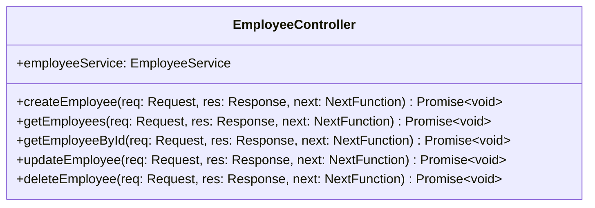

# Employee Controller Class Diagram

```mermaid
classDiagram
  class EmployeeController {
    +employeeService: EmployeeService
    +createEmployee(req: Request, res: Response, next: NextFunction) Promise~void~
    +getEmployees(req: Request, res: Response, next: NextFunction) Promise~void~
    +getEmployeeById(req: Request, res: Response, next: NextFunction) Promise~void~
    +updateEmployee(req: Request, res: Response, next: NextFunction) Promise~void~
    +deleteEmployee(req: Request, res: Response, next: NextFunction) Promise~void~
  }
```

---
