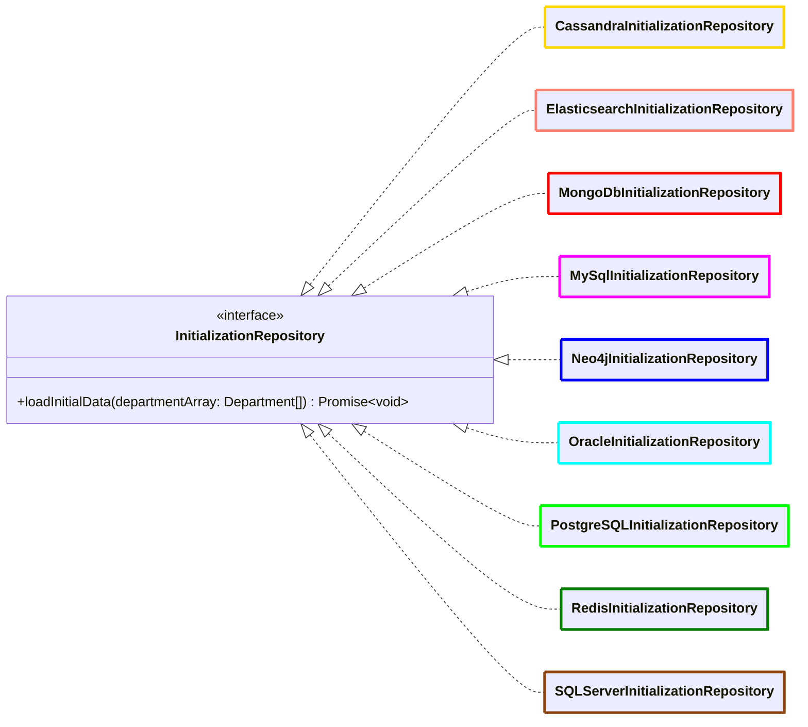

# Initialization Repository Class Diagram

```mermaid
---
  config:
    class:
      hideEmptyMembersBox: true
---
classDiagram
    direction LR
    class InitializationRepository {
        <<interface>>
        +loadInitialData(departmentArray: Department[]) Promise~void~
    }

    class CassandraInitializationRepository:::gold { }
    class ElasticsearchInitializationRepository:::salmon { }
    class MongoDbInitializationRepository:::red { }
    class MySqlInitializationRepository:::magenta { }
    class Neo4jInitializationRepository:::blue { }
    class OracleInitializationRepository:::cyan { }
    class PostgreSQLInitializationRepository:::lime { }
    class RedisInitializationRepository:::green { }
    class SQLServerInitializationRepository:::brown { }

    InitializationRepository <|.. CassandraInitializationRepository
    InitializationRepository <|.. ElasticsearchInitializationRepository
    InitializationRepository <|.. MongoDbInitializationRepository
    InitializationRepository <|.. MySqlInitializationRepository
    InitializationRepository <|.. Neo4jInitializationRepository
    InitializationRepository <|.. OracleInitializationRepository
    InitializationRepository <|.. PostgreSQLInitializationRepository
    InitializationRepository <|.. RedisInitializationRepository
    InitializationRepository <|.. SQLServerInitializationRepository
%% Styles
%% Styles
    classDef brown stroke:saddlebrown,stroke-width:3px
    classDef blue stroke:blue,stroke-width:3px
    classDef chocolate stroke:chocolate,stroke-width:3px
    classDef cyan stroke:cyan,stroke-width:3px
    classDef gold stroke:gold,stroke-width:3px
    classDef green stroke:green,stroke-width:3px
    classDef lime stroke:lime,stroke-width:3px
    classDef magenta stroke:magenta,stroke-width:3px
    classDef olive stroke:olive,stroke-width:3px
    classDef orange stroke:orange,stroke-width:3px
    classDef orangeDark stroke:#FF5C00,stroke-width:3px
    classDef pink stroke:pink,stroke-width:3px
    classDef red stroke:red,stroke-width:3px
    classDef redBrown stroke:brown,stroke-width:3px
    classDef salmon stroke:salmon,stroke-width:3px
    classDef sienna stroke:sienna,stroke-width:3px
    classDef violet stroke:violet,stroke-width:3px
    classDef yellow stroke:yellow,stroke-width:3px
```

---
