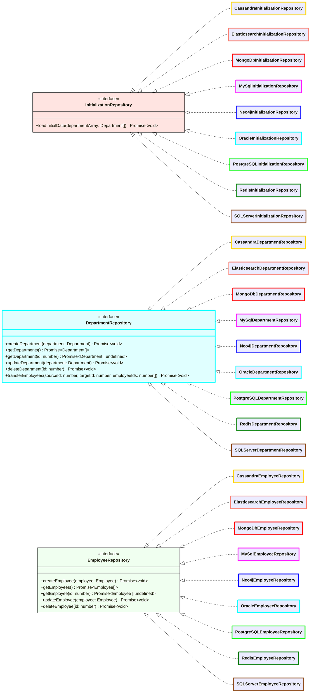

# Repositories Class Diagram

```mermaid
---
  config:
    class:
      hideEmptyMembersBox: true
---
classDiagram
  direction LR
%% Initialization Repositories
  class InitializationRepository:::mistyrose {
    <<interface>>
    +loadInitialData(departmentArray: Department[]) Promise~void~
  }

  class CassandraInitializationRepository:::gold { }
  class ElasticsearchInitializationRepository:::salmon { }
  class MongoDbInitializationRepository:::red { }
  class MySqlInitializationRepository:::magenta { }
  class Neo4jInitializationRepository:::blue { }
  class OracleInitializationRepository:::cyan { }
  class PostgreSQLInitializationRepository:::lime { }
  class RedisInitializationRepository:::green { }
  class SQLServerInitializationRepository:::brown { }

  InitializationRepository <|.. CassandraInitializationRepository
  InitializationRepository <|.. ElasticsearchInitializationRepository
  InitializationRepository <|.. MongoDbInitializationRepository
  InitializationRepository <|.. MySqlInitializationRepository
  InitializationRepository <|.. Neo4jInitializationRepository
  InitializationRepository <|.. OracleInitializationRepository
  InitializationRepository <|.. PostgreSQLInitializationRepository
  InitializationRepository <|.. RedisInitializationRepository
  InitializationRepository <|.. SQLServerInitializationRepository
%% Department Repositories
  class DepartmentRepository:::lightcyan {
    <<interface>>
    +createDepartment(department: Department) Promise~void~
    +getDepartments() Promise~Department[]~
    +getDepartment(id: number) Promise~Department | undefined~
    +updateDepartment(department: Department) Promise~void~
    +deleteDepartment(id: number) Promise~void~
    +transferEmployees(sourceId: number, targetId: number, employeeIds: number[]) Promise~void~
  }

  class CassandraDepartmentRepository:::gold { }
  class ElasticsearchDepartmentRepository:::salmon { }
  class MongoDbDepartmentRepository:::red { }
  class MySqlDepartmentRepository:::magenta { }
  class Neo4jDepartmentRepository:::blue { }
  class OracleDepartmentRepository:::cyan { }
  class PostgreSQLDepartmentRepository:::lime { }
  class RedisDepartmentRepository:::green { }
  class SQLServerDepartmentRepository:::brown { }

  DepartmentRepository <|.. CassandraDepartmentRepository
  DepartmentRepository <|.. ElasticsearchDepartmentRepository
  DepartmentRepository <|.. MongoDbDepartmentRepository
  DepartmentRepository <|.. MySqlDepartmentRepository
  DepartmentRepository <|.. Neo4jDepartmentRepository
  DepartmentRepository <|.. OracleDepartmentRepository
  DepartmentRepository <|.. PostgreSQLDepartmentRepository
  DepartmentRepository <|.. RedisDepartmentRepository
  DepartmentRepository <|.. SQLServerDepartmentRepository
%% Employee Repositories
  class EmployeeRepository:::honeydew {
    <<interface>>
    +createEmployee(employee: Employee) Promise~void~
    +getEmployees() Promise~Employee[]~
    +getEmployee(id: number) Promise~Employee | undefined~
    +updateEmployee(employee: Employee) Promise~void~
    +deleteEmployee(id: number) Promise~void~
  }

  class CassandraEmployeeRepository:::gold { }
  class ElasticsearchEmployeeRepository:::salmon { }
  class MongoDbEmployeeRepository:::red { }
  class MySqlEmployeeRepository:::magenta { }
  class Neo4jEmployeeRepository:::blue { }
  class OracleEmployeeRepository:::cyan { }
  class PostgreSQLEmployeeRepository:::lime { }
  class RedisEmployeeRepository:::green { }
  class SQLServerEmployeeRepository:::brown { }

  EmployeeRepository <|.. CassandraEmployeeRepository
  EmployeeRepository <|.. ElasticsearchEmployeeRepository
  EmployeeRepository <|.. MongoDbEmployeeRepository
  EmployeeRepository <|.. MySqlEmployeeRepository
  EmployeeRepository <|.. Neo4jEmployeeRepository
  EmployeeRepository <|.. OracleEmployeeRepository
  EmployeeRepository <|.. PostgreSQLEmployeeRepository
  EmployeeRepository <|.. RedisEmployeeRepository
  EmployeeRepository <|.. SQLServerEmployeeRepository
%% Styles
%% Styles
  classDef honeydew fill:honeydew,stroke:black,stroke-width:1px
  classDef lightcyan fill:lightcyan,stroke:black,stroke-width:1px
  classDef mistyrose fill:mistyrose,stroke:black,stroke-width:1px

  classDef brown stroke:saddlebrown,stroke-width:3px
  classDef blue stroke:blue,stroke-width:3px
  classDef chocolate stroke:chocolate,stroke-width:3px
  classDef cyan stroke:cyan,stroke-width:3px
  classDef gold stroke:gold,stroke-width:3px
  classDef green stroke:green,stroke-width:3px
  classDef lime stroke:lime,stroke-width:3px
  classDef magenta stroke:magenta,stroke-width:3px
  classDef olive stroke:olive,stroke-width:3px
  classDef orange stroke:orange,stroke-width:3px
  classDef orangeDark stroke:#FF5C00,stroke-width:3px
  classDef pink stroke:pink,stroke-width:3px
  classDef red stroke:red,stroke-width:3px
  classDef redBrown stroke:brown,stroke-width:3px
  classDef salmon stroke:salmon,stroke-width:3px
  classDef sienna stroke:sienna,stroke-width:3px
  classDef violet stroke:violet,stroke-width:3px
  classDef yellow stroke:yellow,stroke-width:3px
```

---
