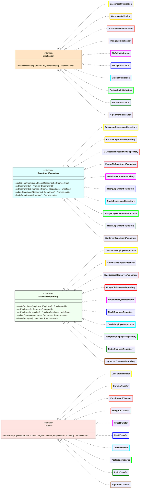

# Repositories Class Diagram

```mermaid
---
  config:
    class:
      hideEmptyMembersBox: true
---
classDiagram
  direction LR
%% Initialization
  class Initialization:::bisque {
    <<interface>>
    +loadInitialData(departmentArray: Department[]) Promise~void~
  }

  class CassandraInitialization:::yellow { }
  class ChromaInitialization:::gold { }
  class ElasticsearchInitialization:::salmon { }
  class MongoDbInitialization:::red { }
  class MySqlInitialization:::magenta { }
  class Neo4jInitialization:::blue { }
  class OracleInitialization:::cyan { }
  class PostgreSqlInitialization:::lime { }
  class RedisInitialization:::green { }
  class SqlServerInitialization:::brown { }

  Initialization <|.. CassandraInitialization
  Initialization <|.. ChromaInitialization
  Initialization <|.. ElasticsearchInitialization
  Initialization <|.. MongoDbInitialization
  Initialization <|.. MySqlInitialization
  Initialization <|.. Neo4jInitialization
  Initialization <|.. OracleInitialization
  Initialization <|.. PostgreSqlInitialization
  Initialization <|.. RedisInitialization
  Initialization <|.. SqlServerInitialization
%% Department Repositories
  class DepartmentRepository:::light_c_y_a_n {
    <<interface>>
    +createDepartment(department: Department) Promise~void~
    +getDepartments() Promise~Department[]~
    +getDepartment(id: number) Promise~Department | undefined~
    +updateDepartment(department: Department) Promise~void~
    +deleteDepartment(id: number) Promise~void~
  }

  class CassandraDepartmentRepository:::yellow { }
  class ChromaDepartmentRepository:::gold { }
  class ElasticsearchDepartmentRepository:::salmon { }
  class MongoDbDepartmentRepository:::red { }
  class MySqlDepartmentRepository:::magenta { }
  class Neo4jDepartmentRepository:::blue { }
  class OracleDepartmentRepository:::cyan { }
  class PostgreSqlDepartmentRepository:::lime { }
  class RedisDepartmentRepository:::green { }
  class SqlServerDepartmentRepository:::brown { }

  DepartmentRepository <|.. CassandraDepartmentRepository
  DepartmentRepository <|.. ChromaDepartmentRepository
  DepartmentRepository <|.. ElasticsearchDepartmentRepository
  DepartmentRepository <|.. MongoDbDepartmentRepository
  DepartmentRepository <|.. MySqlDepartmentRepository
  DepartmentRepository <|.. Neo4jDepartmentRepository
  DepartmentRepository <|.. OracleDepartmentRepository
  DepartmentRepository <|.. PostgreSqlDepartmentRepository
  DepartmentRepository <|.. RedisDepartmentRepository
  DepartmentRepository <|.. SqlServerDepartmentRepository
%% Employee Repositories
  class EmployeeRepository:::honeydew {
    <<interface>>
    +createEmployee(employee: Employee) Promise~void~
    +getEmployees() Promise~Employee[]~
    +getEmployee(id: number) Promise~Employee | undefined~
    +updateEmployee(employee: Employee) Promise~void~
    +deleteEmployee(id: number) Promise~void~
  }

  class CassandraEmployeeRepository:::yellow { }
  class ChromaEmployeeRepository:::gold { }
  class ElasticsearchEmployeeRepository:::salmon { }
  class MongoDbEmployeeRepository:::red { }
  class MySqlEmployeeRepository:::magenta { }
  class Neo4jEmployeeRepository:::blue { }
  class OracleEmployeeRepository:::cyan { }
  class PostgreSqlEmployeeRepository:::lime { }
  class RedisEmployeeRepository:::green { }
  class SqlServerEmployeeRepository:::brown { }

  EmployeeRepository <|.. CassandraEmployeeRepository
  EmployeeRepository <|.. ChromaEmployeeRepository
  EmployeeRepository <|.. ElasticsearchEmployeeRepository
  EmployeeRepository <|.. MongoDbEmployeeRepository
  EmployeeRepository <|.. MySqlEmployeeRepository
  EmployeeRepository <|.. Neo4jEmployeeRepository
  EmployeeRepository <|.. OracleEmployeeRepository
  EmployeeRepository <|.. PostgreSqlEmployeeRepository
  EmployeeRepository <|.. RedisEmployeeRepository
  EmployeeRepository <|.. SqlServerEmployeeRepository
%% Transfer
  class Transfer:::mistyrose {
    <<interface>>
    +transferEmployees(sourceId: number, targetId: number, employeeIds: number[]) Promise~void~
  }

  class CassandraTransfer:::yellow { }
  class ChromaTransfer:::gold { }
  class ElasticsearchTransfer:::salmon { }
  class MongoDbTransfer:::red { }
  class MySqlTransfer:::magenta { }
  class Neo4jTransfer:::blue { }
  class OracleTransfer:::cyan { }
  class PostgreSqlTransfer:::lime { }
  class RedisTransfer:::green { }
  class SqlServerTransfer:::brown { }

  Transfer <|.. CassandraTransfer
  Transfer <|.. ChromaTransfer
  Transfer <|.. ElasticsearchTransfer
  Transfer <|.. MongoDbTransfer
  Transfer <|.. MySqlTransfer
  Transfer <|.. Neo4jTransfer
  Transfer <|.. OracleTransfer
  Transfer <|.. PostgreSqlTransfer
  Transfer <|.. RedisTransfer
  Transfer <|.. SqlServerTransfer
%% Styles
  classDef honeydew fill:honeydew,stroke:black,stroke-width:1px
  classDef light_c_y_a_n fill:lightcyan,stroke:black,stroke-width:1px
  classDef mistyrose fill:mistyrose,stroke:black,stroke-width:1px
  classDef bisque fill:bisque,stroke:black,stroke-width:1px

  classDef brown stroke:saddlebrown,stroke-width:3px
  classDef blue stroke:blue,stroke-width:3px
  classDef chocolate stroke:chocolate,stroke-width:3px
  classDef cyan stroke:cyan,stroke-width:3px
  classDef gold stroke:gold,stroke-width:3px
  classDef green stroke:green,stroke-width:3px
  classDef lime stroke:lime,stroke-width:3px
  classDef magenta stroke:magenta,stroke-width:3px
  classDef olive stroke:olive,stroke-width:3px
  classDef orange stroke:orange,stroke-width:3px
  classDef orangeDark stroke:#FF5C00,stroke-width:3px
  classDef pink stroke:pink,stroke-width:3px
  classDef red stroke:red,stroke-width:3px
  classDef redBrown stroke:brown,stroke-width:3px
  classDef salmon stroke:salmon,stroke-width:3px
  classDef sienna stroke:sienna,stroke-width:3px
  classDef violet stroke:violet,stroke-width:3px
  classDef yellow stroke:yellow,stroke-width:3px
```

---
