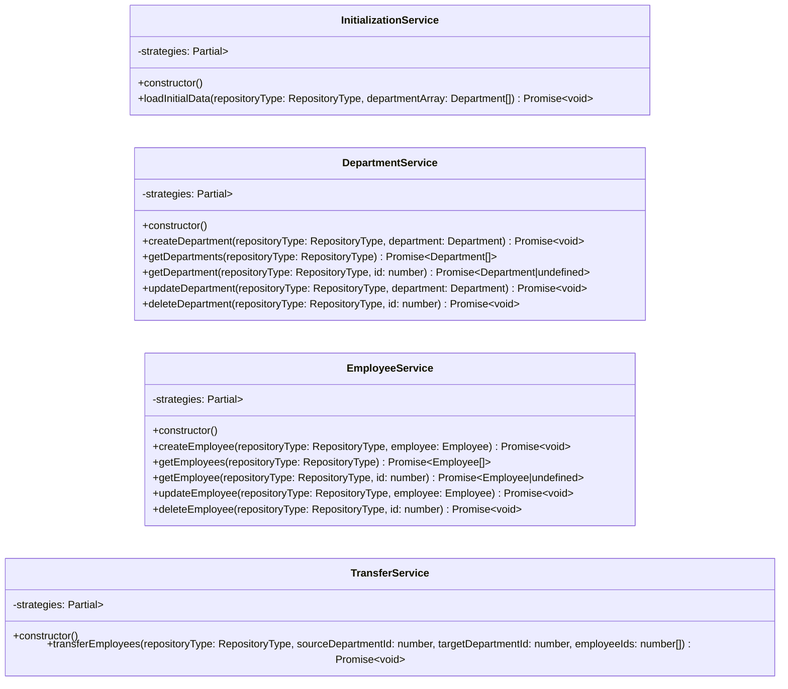

# Services Class Diagram

```mermaid
classDiagram
  direction LR
  class InitializationService {
    -strategies: Partial<Record<RepositoryType, Initialization>>
    +constructor()
    +loadInitialData(repositoryType: RepositoryType, departmentArray: Department[]) Promise~void~
  }

  class DepartmentService {
    -strategies: Partial<Record<RepositoryType, DepartmentRepository>>
    +constructor()
    +createDepartment(repositoryType: RepositoryType, department: Department) Promise~void~
    +getDepartments(repositoryType: RepositoryType) Promise~Department[]~
    +getDepartment(repositoryType: RepositoryType, id: number) Promise~Department|undefined~
    +updateDepartment(repositoryType: RepositoryType, department: Department) Promise~void~
    +deleteDepartment(repositoryType: RepositoryType, id: number) Promise~void~
  }

  class EmployeeService {
    -strategies: Partial<Record<RepositoryType, EmployeeRepository>>
    +constructor()
    +createEmployee(repositoryType: RepositoryType, employee: Employee) Promise~void~
    +getEmployees(repositoryType: RepositoryType) Promise~Employee[]~
    +getEmployee(repositoryType: RepositoryType, id: number) Promise~Employee|undefined~
    +updateEmployee(repositoryType: RepositoryType, employee: Employee) Promise~void~
    +deleteEmployee(repositoryType: RepositoryType, id: number) Promise~void~
  }

  class TransferService {
    -strategies: Partial<Record<RepositoryType, DepartmentRepository>>
    +constructor()
    +transferEmployees(repositoryType: RepositoryType, sourceDepartmentId: number, targetDepartmentId: number, employeeIds: number[]) Promise~void~
  }
```

---
