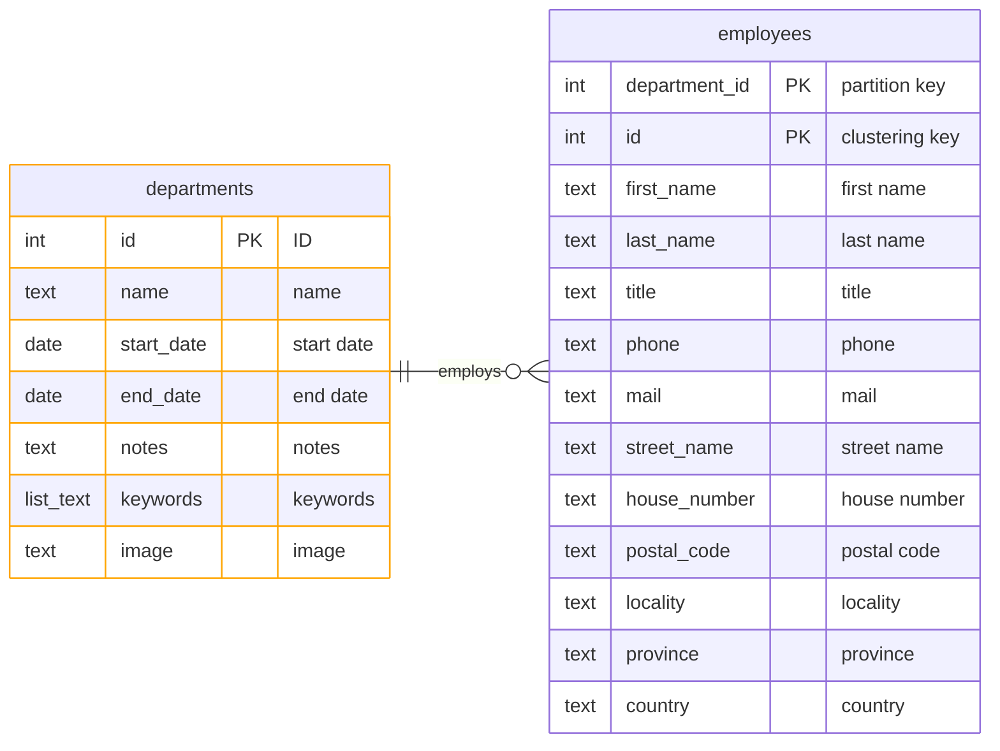

# Cassandra Entity Relationship Diagram

```mermaid
erDiagram
direction LR
%% Entities
    DEP[departments] {
        int id PK "ID"
        text name "name"
        date start_date "start date"
        date end_date "end date"
        text notes "notes"
        list_text keywords "keywords"
        text image "image"
    }
    EMP[employees] {
        int department_id PK "partition key"
        int id PK "clustering key"
        text first_name "first name"
        text last_name "last name"
        text title "title"
        text phone "phone"
        text mail "mail"
        text street_name "street name"
        text house_number "house number"
        text postal_code "postal code"
        text locality "locality"
        text province "province"
        text country "country"
    }
%% Relationships 
    DEP ||--o{ EMP: employs
%%  Styles
    style DEP stroke:orange
```
