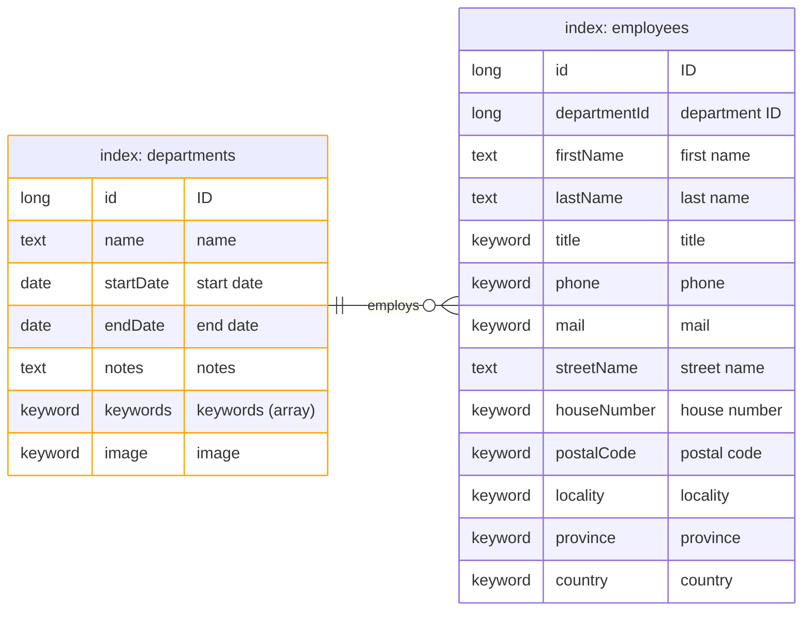

# Elasticsearch Logical Schema Diagram

```mermaid
erDiagram
direction LR
%% Entities
  DEP["index: departments"] {
    long id "ID"
    text name "name"
    date startDate "start date"
    date endDate "end date"
    text notes "notes"
    keyword keywords "keywords (array)"
    keyword image "image"
  }
  EMP["index: employees"] {
    long id "ID"
    long departmentId "department ID"
    text firstName "first name"
    text lastName "last name"
    keyword title "title"
    keyword phone "phone"
    keyword mail "mail"
    text streetName "street name"
    keyword houseNumber "house number"
    keyword postalCode "postal code"
    keyword locality "locality"
    keyword province "province"
    keyword country "country"
  }
%% Relationships 
  DEP ||--o{ EMP: employs
%%  Styles
  style DEP stroke:orange
```

> [!NOTE]
> Elasticsearch stores documents in indices.
