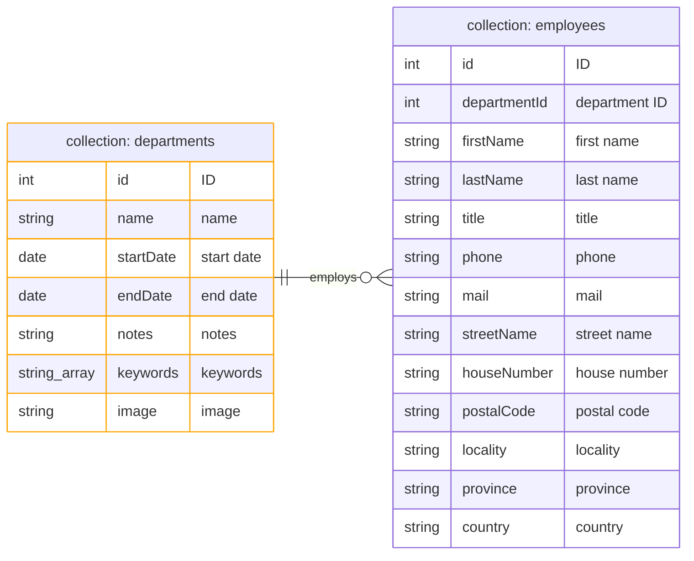

# MongoDB Logical Schema Diagram

> [!NOTE]
> MongoDB collections store BSON documents.
> Even though it is schema-less, the diagram represents the logical structure of the `departments` and `employees` collections.
