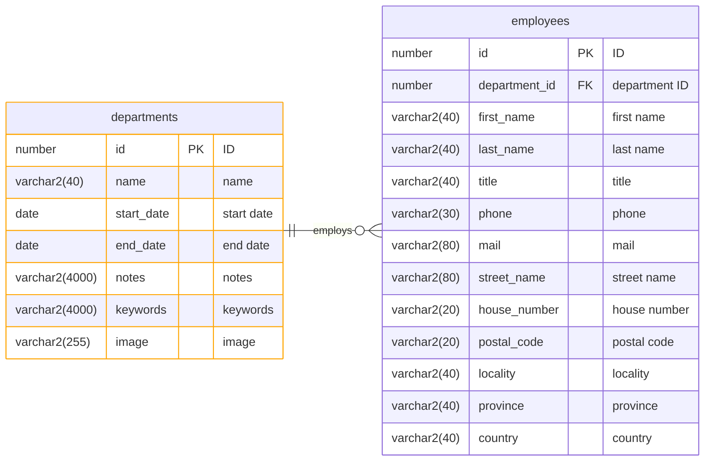

# Oracle Entity Relationship Diagram

```mermaid
erDiagram
direction LR
%% Entities
  DEP[departments] {
    number id PK "ID"
    varchar2(40) name "name"
    date start_date "start date"
    date end_date "end date"
    varchar2(4000) notes "notes"
    varchar2(4000) keywords "keywords"
    varchar2(255) image "image"
  }
  EMP[employees] {
    number id PK "ID"
    number department_id FK "department ID"
    varchar2(40) first_name "first name"
    varchar2(40) last_name "last name"
    varchar2(40) title "title"
    varchar2(30) phone "phone"
    varchar2(80) mail "mail"
    varchar2(80) street_name "street name"
    varchar2(20) house_number "house number"
    varchar2(20) postal_code "postal code"
    varchar2(40) locality "locality"
    varchar2(40) province "province"
    varchar2(40) country "country"
  }
%% Relationships 
  DEP ||--o{ EMP: employs
%%  Styles
  style DEP stroke:orange
```
