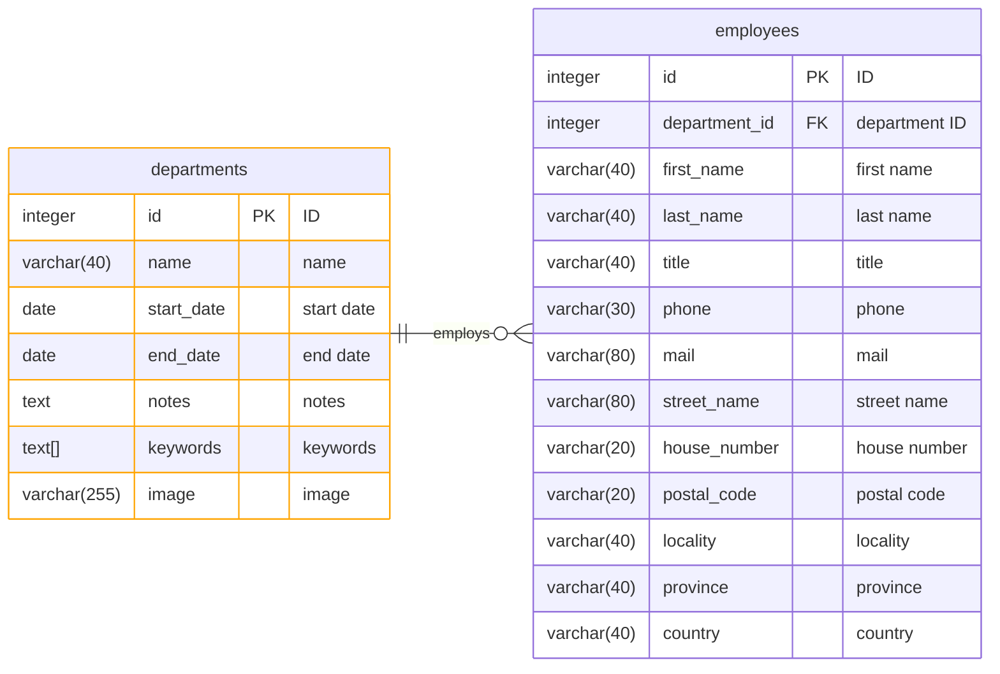

# PostgreSQL Entity Relationship Diagram

```mermaid
erDiagram
direction LR
%% Entities
    DEP[departments] {
        integer id PK "ID"
        varchar(40) name "name"
        date start_date "start date"
        date end_date "end date"
        text notes "notes"
        text[] keywords "keywords"
        varchar(255) image "image"
    }
    EMP[employees] {
        integer id PK "ID"
        integer department_id FK "department ID"
        varchar(40) first_name "first name"
        varchar(40) last_name "last name"
        varchar(40) title "title"
        varchar(30) phone "phone"
        varchar(80) mail "mail"
        varchar(80) street_name "street name"
        varchar(20) house_number "house number"
        varchar(20) postal_code "postal code"
        varchar(40) locality "locality"
        varchar(40) province "province"
        varchar(40) country "country"
    }
%% Relationships 
    DEP ||--o{ EMP: employs
%%  Styles
    style DEP stroke:orange
```
