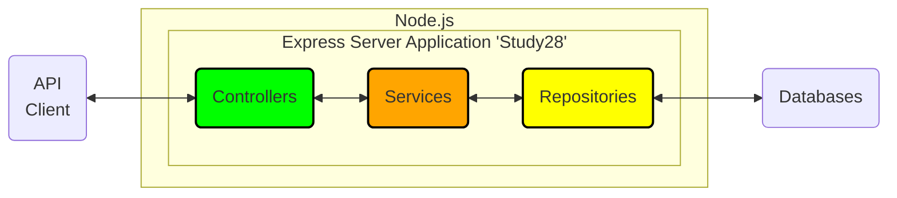

# Business Logic Flowchart Diagram

```mermaid
flowchart LR
  CTRL(Controllers):::greenBox
  SERV(Services):::orangeBox
  REPO(Repositories):::yellowBox
  CLI("API<br>Client")
  DB(Databases)
%% Flows
  CLI <-->CTRL
  subgraph Node.js
    subgraph "Express Server Application 'Study28'"
      CTRL <--> SERV <--> REPO
    end
  end
  REPO <--> DB
%% Style Definitions
  classDef redBox fill: #ff6666, stroke: #000, stroke-width: 2px
  classDef greenBox fill: #00ff00, stroke: #000, stroke-width: 2px
  classDef cyanBox fill: #00ffff, stroke: #000, stroke-width: 2px
  classDef yellowBox fill: #ffff00, stroke: #000, stroke-width: 2px
  classDef orangeBox  fill: #ffa500,stroke: #000, stroke-width:2px
```

---
