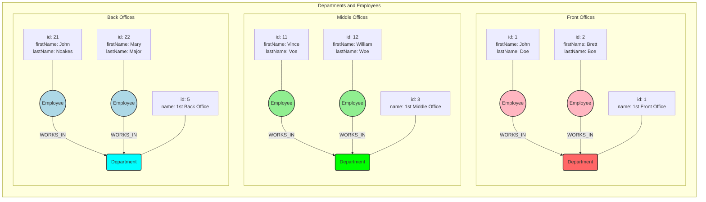

#  Neo4j Database Graph
Presented are three selected departments:
- 1st Front Office
- 1st Middle Office
- 1st Back Office

- **Department**
  - node label: Department
  - node property: name
- **Employee**
  - node label: Employee
  - node property: firstName
  - node property: lastName

The relationship type between **Employee** and **Department**: **WORKS_IN**

---
