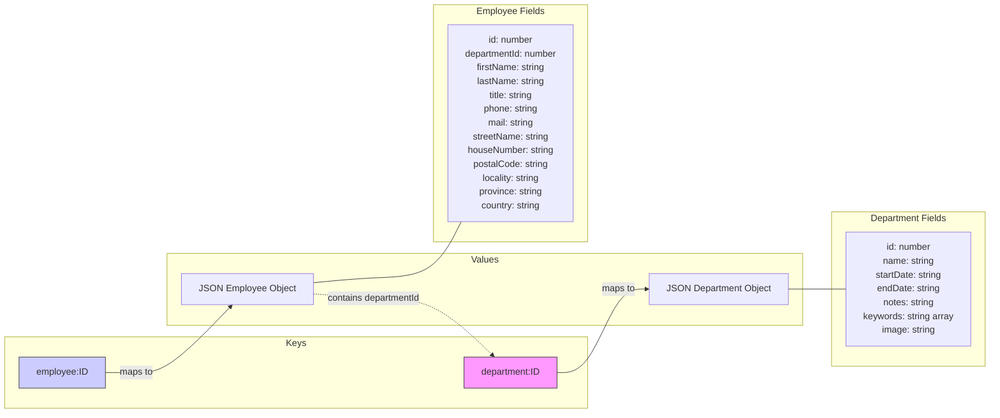

# Redis Data Structure Diagram

```mermaid
flowchart LR
    subgraph Keys
        D_Key[department:ID]
        E_Key[employee:ID]
    end

    subgraph Values
        D_Val[JSON Department Object]
        E_Val[JSON Employee Object]
    end

    D_Key -->|maps to| D_Val
    E_Key -->|maps to| E_Val

    E_Val -.->|contains departmentId| D_Key

    subgraph Department Fields
        D_Val --- d["`id: number
                      name: string
                      startDate: string
                      endDate: string
                      notes: string
                      keywords: string array
                      image: string`"]    
    end

    subgraph Employee Fields
        E_Val --- e["`id: number
                      departmentId: number
                      firstName: string
                      lastName: string
                      title: string
                      phone: string
                      mail: string
                      streetName: string
                      houseNumber: string
                      postalCode: string
                      locality: string
                      province: string
                      country: string`"]
    end

    style D_Key fill:#f9f,stroke:#333
    style E_Key fill:#ccf,stroke:#333
```
