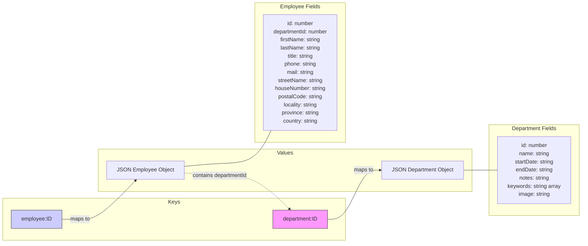

# Redis Data Structure Diagram

```mermaid
flowchart LR
  subgraph Keys
    Dep_Key[department:ID]
    Emp_Key[employee:ID]
  end

  subgraph Values
    Dep_Val[JSON Department Object]
    Emp_Val[JSON Employee Object]
  end

  Dep_Key -->|maps to| Dep_Val
  Emp_Key -->|maps to| Emp_Val

  Emp_Val -.->|contains departmentId| Dep_Key

  subgraph Department Fields
    Dep_Val --- d["`
      id: number
      name: string
      startDate: string
      endDate: string
      notes: string
      keywords: string array
      image: string
    `"]    
  end

  subgraph Employee Fields
    Emp_Val --- e["`
      id: number
      departmentId: number
      firstName: string
      lastName: string
      title: string
      phone: string
      mail: string
      streetName: string
      houseNumber: string
      postalCode: string
      locality: string
      province: string
      country: string
    `"]
  end
%% Styles
  style Dep_Key fill:#f9f,stroke:#333
  style Emp_Key fill:#ccf,stroke:#333
```
