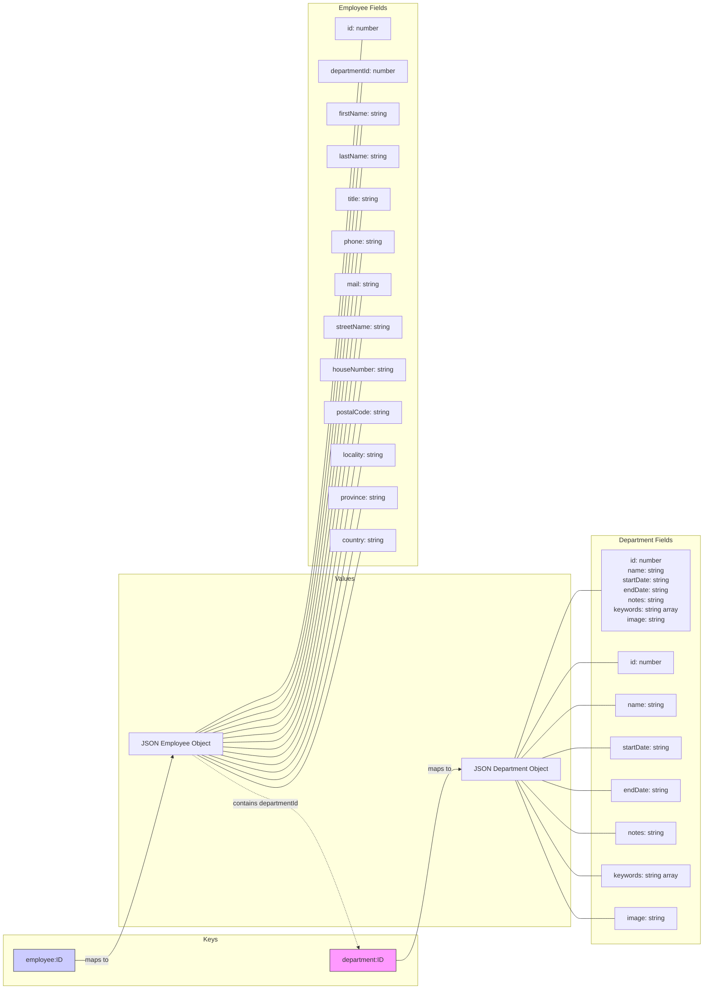

# Redis Data Structure Diagram

```mermaid
flowchart LR
    subgraph Keys
        D_Key[department:ID]
        E_Key[employee:ID]
    end

    subgraph Values
        D_Val[JSON Department Object]
        E_Val[JSON Employee Object]
    end

    D_Key -->|maps to| D_Val
    E_Key -->|maps to| E_Val

    E_Val -.->|contains departmentId| D_Key

    subgraph Department Fields
        D_Val --- d["`id: number
                      name: string
                      startDate: string
                      endDate: string
                      notes: string
                      keywords: string array
                      image: string`"]    
        D_Val --- d01[id: number]
        D_Val --- d02[name: string]
        D_Val --- d03[startDate: string]
        D_Val --- d04[endDate: string]
        D_Val --- d05[notes: string]
        D_Val --- d06[keywords: string array]
        D_Val --- d07[image: string]
    end

    subgraph Employee Fields
        E_Val --- e01[id: number]
        E_Val --- e02[departmentId: number]
        E_Val --- e03[firstName: string]
        E_Val --- e04[lastName: string]
        E_Val --- e05[title: string]
        E_Val --- e06[phone: string]
        E_Val --- e07[mail: string]
        E_Val --- e08[streetName: string]
        E_Val --- e09[houseNumber: string]
        E_Val --- e10[postalCode: string]
        E_Val --- e11[locality: string]
        E_Val --- e12[province: string]
        E_Val --- e13[country: string]
    end

    style D_Key fill:#f9f,stroke:#333
    style E_Key fill:#ccf,stroke:#333
```
