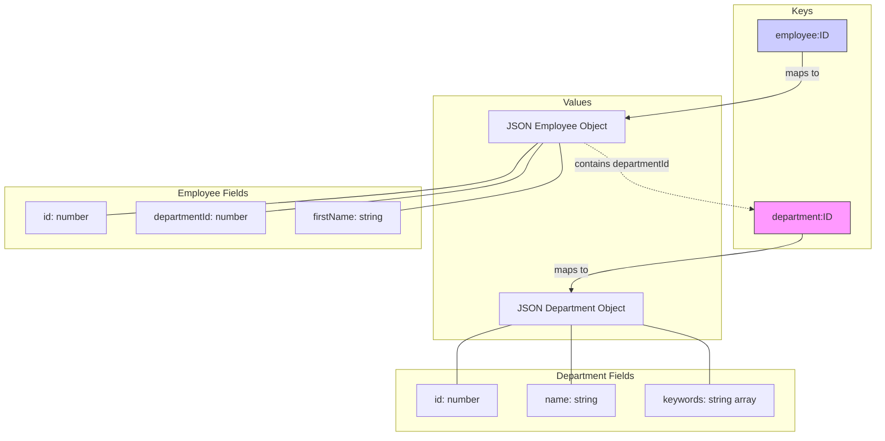

# Redis Data Structure Diagram

```mermaid
flowchart TD
    subgraph Keys
        D_Key[department:ID]
        E_Key[employee:ID]
    end

    subgraph Values
        D_Val[JSON Department Object]
        E_Val[JSON Employee Object]
    end

    D_Key -->|maps to| D_Val
    E_Key -->|maps to| E_Val

    E_Val -.->|contains departmentId| D_Key

    subgraph Department Fields
        D_Val --- d1[id: number]
        D_Val --- d2[name: string]
        D_Val --- d3[keywords: string array]
    end

    subgraph Employee Fields
        E_Val --- e1[id: number]
        E_Val --- e2[departmentId: number]
        E_Val --- e3[firstName: string]
    end

    style D_Key fill:#f9f,stroke:#333
    style E_Key fill:#ccf,stroke:#333
```
