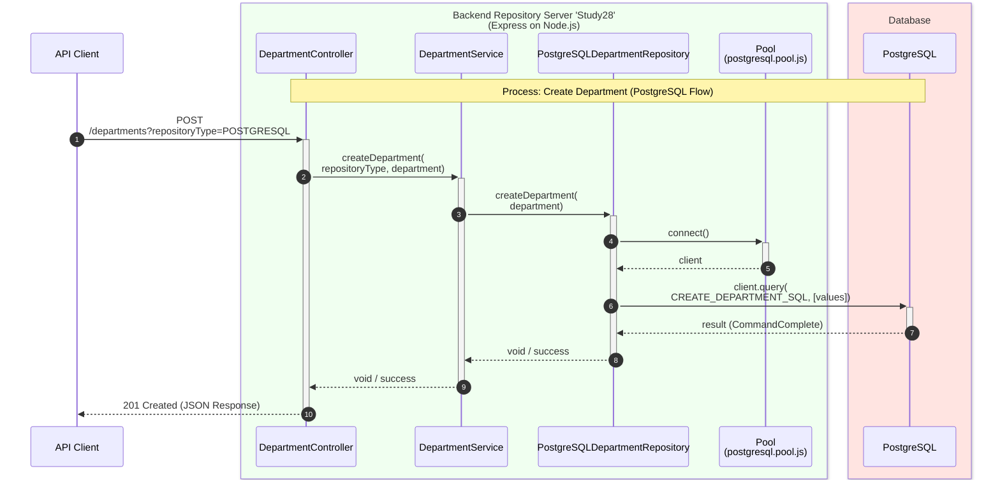

# Create Department Sequence Diagram

API Client - for example **cURL**.

## Process Logic

1. **Controller**: Receives the Request and extracts the _repositoryType_ from the query string and the department from the body.
2. **Service**: Acts as an orchestrator, specifically calling _postgreSQLDepartmentRepository.createDepartment_ based on the passed type.
3. **Repository**: Uses the PostgreSQL Pool to acquire a client and executes the parameterized SQL query.
4. **Database**: Returns the execution result to the repository.

---
