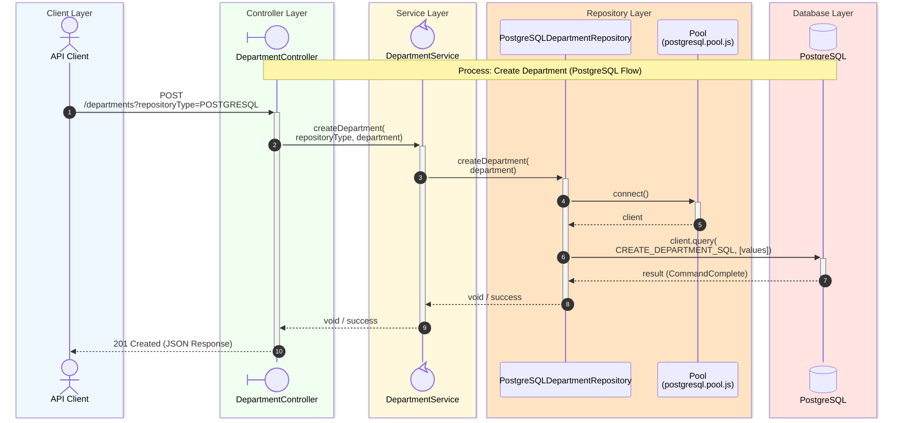

# Create Department Sequence Diagram

## Process Logic

1. **API Client**: Sends the Request (for example **curl**).
1. **Controller**: Receives the Request and extracts the _repositoryType_ from the query string and the department from the body.
1. **Service**: Acts as an orchestrator, specifically calling _postgreSQLDepartmentRepository.createDepartment_ based on the passed type.
1. **Repository**: Uses the PostgreSQL Pool to acquire a client and executes the parameterized SQL query.
1. **Database**: Returns the execution result from PostgreSQL database to the repository.

---
