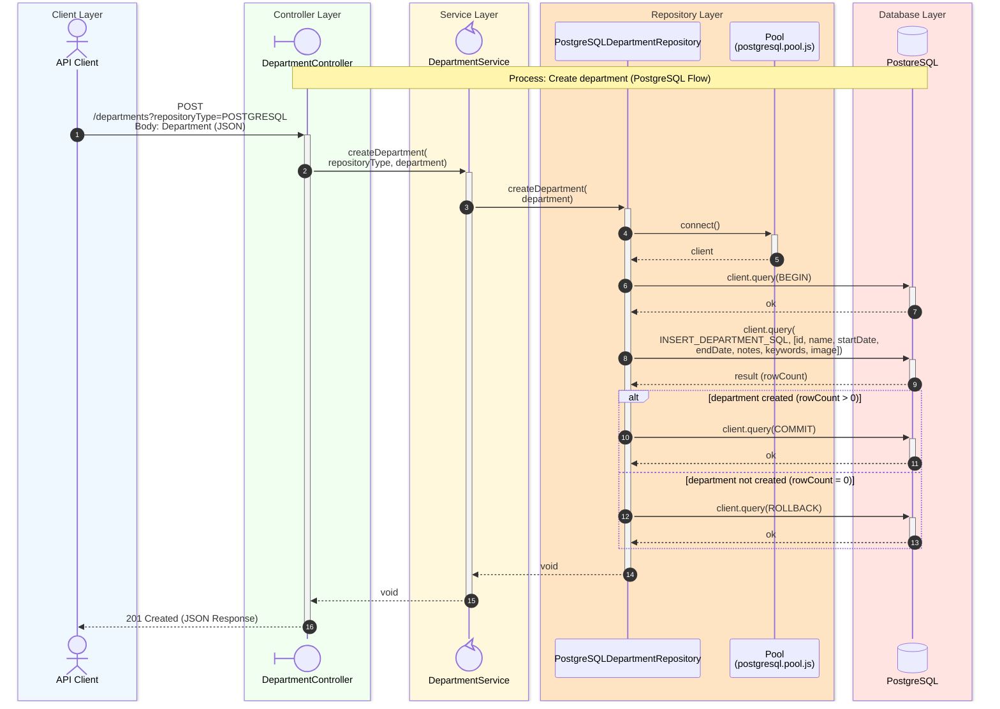

# Create Department Sequence Diagram

## Process Logic

1. **API Client**: Sends the Request with a JSON body containing the new department's fields, including its _id_.
1. **Controller**: Receives the Request, extracts the _repositoryType_ from the query string, and maps the request body to a Department via _bodyToDepartment_, validating that it contains an _id_ (otherwise **400 Bad Request** is returned).
1. **Service**: Acts as an orchestrator, delegating to _postgreSQLDepartmentRepository.createDepartment_ based on the passed type. No numeric range validation of the _id_ is performed here, since the _id_ originates from the validated request body.
1. **Repository**: Uses the PostgreSQL Pool to acquire a client and, within a transaction, executes the parameterized `INSERT_DEPARTMENT_SQL` statement.
   - If the insert affects a row (`rowCount > 0`), the transaction is committed.
   - If no row is inserted (`rowCount = 0`, e.g. a conflicting _id_), the transaction is rolled back and the method returns without throwing.
   - Any database error (for example a constraint violation) is caught, the transaction is rolled back, and a `RepositoryException` is thrown, which the Controller forwards to the error-handling middleware via `next(error)`.
1. **Database**: Executes the `INSERT` statement and returns the affected row count to the repository.
1. **Controller**: Returns **201 Created** once the repository call completes without throwing — as with the update flow, the repository does not surface a "not created" condition, so the response does not differ based on whether a row was actually inserted.

---
