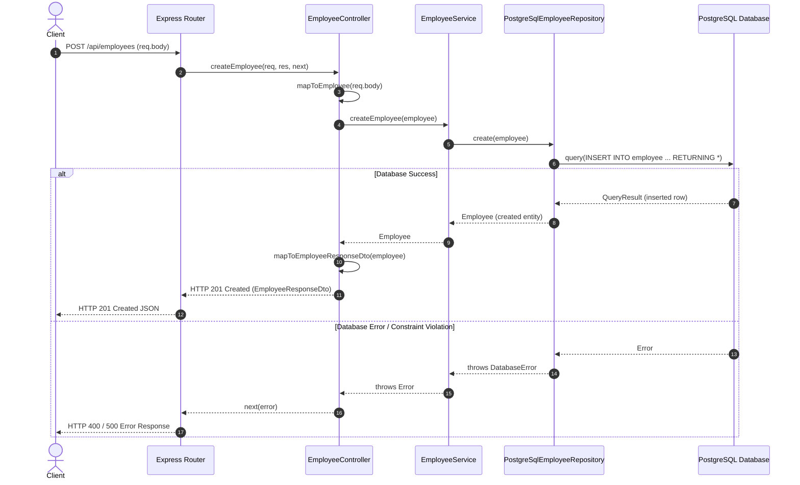

# Create Employee Sequence Diagram

```mermaid
sequenceDiagram
    autonumber
    actor Client
    participant Express as Express Router
    participant Controller as EmployeeController
    participant Service as EmployeeService
    participant Repo as PostgreSqlEmployeeRepository
    participant DB as PostgreSQL Database

    Client->>Express: POST /api/employees (req.body)
    Express->>Controller: createEmployee(req, res, next)
    Controller->>Controller: mapToEmployee(req.body)
    
    Controller->>Service: createEmployee(employee)
    
    Service->>Repo: create(employee)
    Repo->>DB: query(INSERT INTO employee ... RETURNING *)
    
    alt Database Success
        DB-->>Repo: QueryResult (inserted row)
        Repo-->>Service: Employee (created entity)
        Service-->>Controller: Employee
        Controller->>Controller: mapToEmployeeResponseDto(employee)
        Controller-->>Express: HTTP 201 Created (EmployeeResponseDto)
        Express-->>Client: HTTP 201 Created JSON
    else Database Error / Constraint Violation
        DB-->>Repo: Error
        Repo-->>Service: throws DatabaseError
        Service-->>Controller: throws Error
        Controller-->>Express: next(error)
        Express-->>Client: HTTP 400 / 500 Error Response
    end
```
