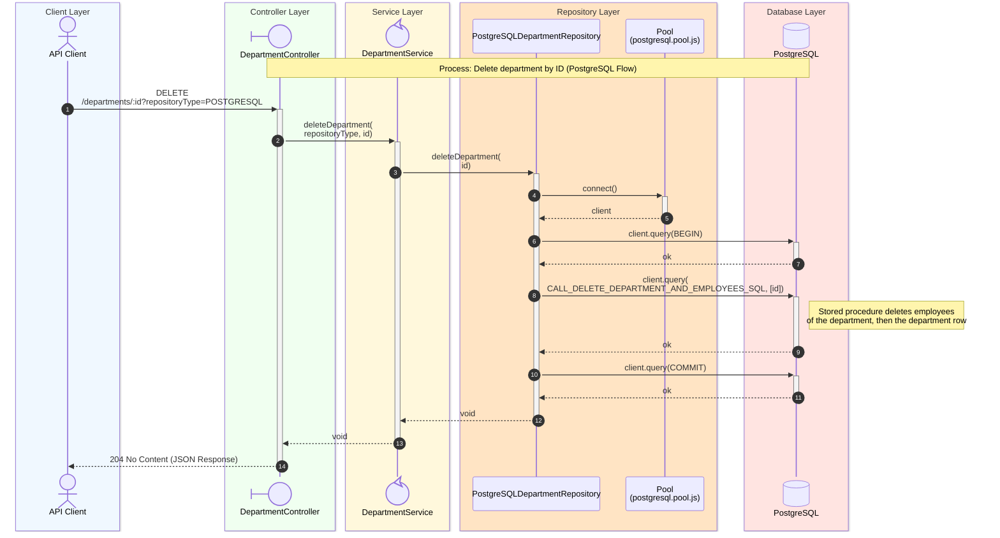

# Delete Department Sequence Diagram

## Process Logic

1. **API Client**: Sends the Request (for example **curl**).
1. **Controller**: Receives the Request, extracts the _repositoryType_ from the query string and the _id_ from the route parameter, validating that it is a numeric value (otherwise **400 Bad Request** is returned).
1. **Service**: Acts as an orchestrator, delegating to _postgreSQLDepartmentRepository.deleteDepartment_ based on the passed type, after validating that the _id_ is an integer within the allowed range.
1. **Repository**: Uses the PostgreSQL Pool to acquire a client and, within a transaction, calls the `delete_department_and_employees` stored procedure via `CALL_DELETE_DEPARTMENT_AND_EMPLOYEES_SQL`. The procedure first deletes every employee referencing the department, then deletes the department row itself, and the transaction is committed. No row-count check is performed, so the call succeeds whether or not a department with that _id_ existed.
1. **Database**: Executes the deletes inside the stored procedure.
1. **Controller**: Returns **204 No Content** unconditionally once the repository call completes without error.

---
