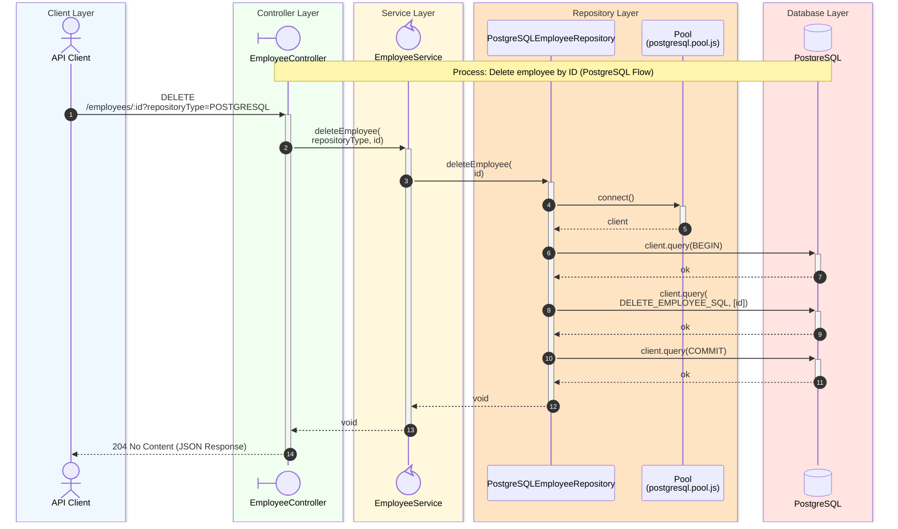

# Delete Employee Sequence Diagram

## Process Logic

1. **API Client**: Sends the Request.
1. **Controller**: Receives the Request, extracts the _repositoryType_ from the query string and the _id_ from the route parameter, validating that it is a numeric value (otherwise **400 Bad Request** is returned).
1. **Service**: Acts as an orchestrator, delegating to _postgreSQLEmployeeRepository.deleteEmployee_ based on the passed type, after validating that the _id_ is an integer within the allowed range.
1. **Repository**: Uses the PostgreSQL Pool to acquire a client and, within a transaction, executes the parameterized `DELETE_EMPLOYEE_SQL` statement directly (unlike the department flow, no stored procedure is involved, since deleting an employee has no cascading effect on other rows), and the transaction is committed. No row-count check is performed, so the call succeeds whether or not an employee with that _id_ existed.
1. **Database**: Executes the `DELETE` statement.
1. **Controller**: Returns **204 No Content** unconditionally once the repository call completes without error.

---
