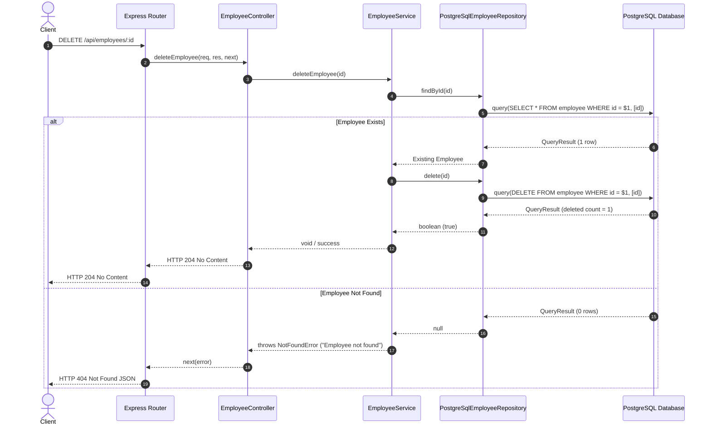

# Delete Employee Sequence Diagram

```mermaid
sequenceDiagram
    autonumber
    actor Client
    participant Express as Express Router
    participant Controller as EmployeeController
    participant Service as EmployeeService
    participant Repo as PostgreSqlEmployeeRepository
    participant DB as PostgreSQL Database

    Client->>Express: DELETE /api/employees/:id
    Express->>Controller: deleteEmployee(req, res, next)
    
    Controller->>Service: deleteEmployee(id)
    
    Service->>Repo: findById(id)
    Repo->>DB: query(SELECT * FROM employee WHERE id = $1, [id])
    
    alt Employee Exists
        DB-->>Repo: QueryResult (1 row)
        Repo-->>Service: Existing Employee
        
        Service->>Repo: delete(id)
        Repo->>DB: query(DELETE FROM employee WHERE id = $1, [id])
        DB-->>Repo: QueryResult (deleted count = 1)
        Repo-->>Service: boolean (true)
        
        Service-->>Controller: void / success
        Controller-->>Express: HTTP 204 No Content
        Express-->>Client: HTTP 204 No Content
    else Employee Not Found
        DB-->>Repo: QueryResult (0 rows)
        Repo-->>Service: null
        Service-->>Controller: throws NotFoundError ("Employee not found")
        Controller-->>Express: next(error)
        Express-->>Client: HTTP 404 Not Found JSON
    end
```
