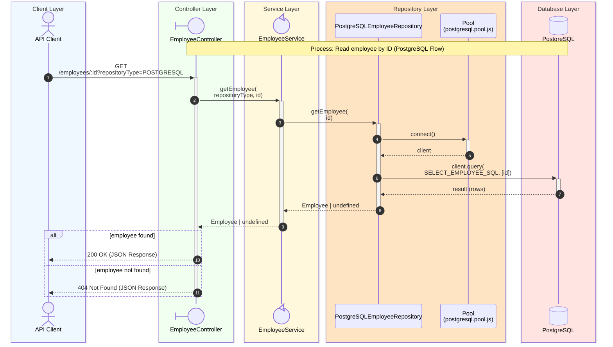

# Read Employee Sequence Diagram

## Process Logic

1. **API Client**: Sends the Request.
1. **Controller**: Receives the Request, extracts the _repositoryType_ from the query string and the _id_ from the route parameter, validating that it is a numeric value.
1. **Service**: Acts as an orchestrator, specifically calling _postgreSQLEmployeeRepository.getEmployee_ based on the passed type, after validating that the _id_ is an integer within the allowed range.
1. **Repository**: Uses the PostgreSQL Pool to acquire a client and executes the parameterized SQL query, mapping the result row to an Employee object.
1. **Database**: Returns the query result rows from PostgreSQL database to the repository.
1. **Controller**: Returns **200 OK** with the employee JSON if found, otherwise **404 Not Found**.

---
