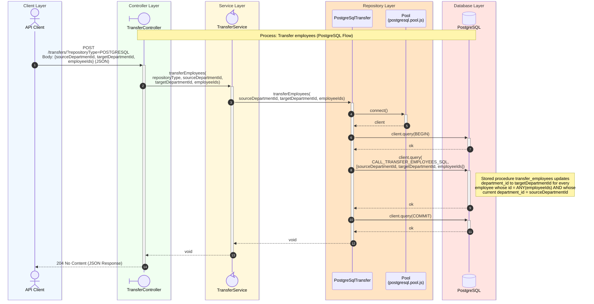

# Transfer Employees Sequence Diagram

## Process Logic

1. **API Client**: Sends the Request with a JSON body containing _sourceDepartmentId_, _targetDepartmentId_, and an _employeeIds_ array.
1. **Controller**: Receives the Request, extracts the _repositoryType_ from the query string (defaulting to `PostgreSQL`), and reads _sourceDepartmentId_, _targetDepartmentId_, and _employeeIds_ from the body, validating that both department ids are truthy and that _employeeIds_ is a non-empty array (otherwise **400 Bad Request** is returned for whichever check fails first).
1. **Service**: Acts as an orchestrator. It resolves the strategy for the given _repositoryType_, throwing a `ReferenceError` if none is implemented. It then validates that both _sourceDepartmentId_ and _targetDepartmentId_ are integers between 1 and `MAX_INT_32`, and that the size of _employeeIds_ does not exceed `MAX_BATCH_EMPLOYEE_IDS` (otherwise a `RangeError` is thrown). If _employeeIds_ is empty, or _sourceDepartmentId_ equals _targetDepartmentId_, the Service logs a warning and returns immediately without calling the repository — there is nothing to transfer. Otherwise it delegates to _postgreSqlTransfer.transferEmployees_.
1. **Repository**: Uses the PostgreSQL Pool to acquire a client and, within a transaction, calls the `transfer_employees` stored procedure via the parameterized `CALL_TRANSFER_EMPLOYEES_SQL` statement, passing _sourceDepartmentId_, _targetDepartmentId_, and _employeeIds_. The transaction is then committed.
   - No row-count check is performed, so the call succeeds whether or not any employee actually matched the source department and id list.
   - Any database error (for example a constraint violation) is caught, the transaction is rolled back, and a `RepositoryException` is thrown, which the Controller forwards to the error-handling middleware via `next(error)`.
1. **Database**: Executes the stored procedure call, re-assigning matching employees to the target department, inside the transaction.
1. **Controller**: Returns **204 No Content** once the repository call completes without throwing. This also covers the Service's "nothing to transfer" short-circuit cases (empty _employeeIds_, or source and target department being the same), which resolve silently without reaching the Repository.

---
