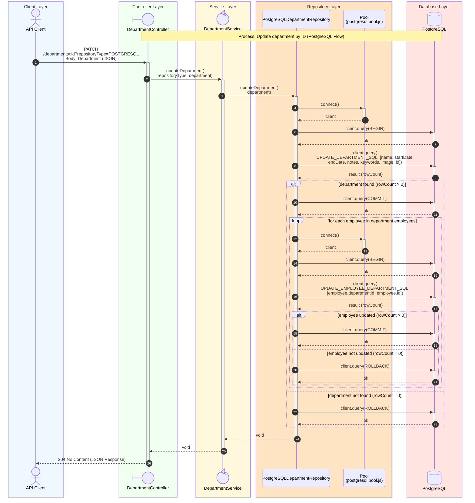

# Update Department Sequence Diagram

## Process Logic

1. **API Client**: Sends the Request (for example **curl**) with a JSON body containing the department's _id_ and the fields to be updated.
1. **Controller**: Receives the Request, extracts the _repositoryType_ from the query string, and maps the request body to a Department via _bodyToDepartment_, validating that it contains an _id_ (otherwise **400 Bad Request** is returned).
1. **Service**: Acts as an orchestrator, delegating to _postgreSQLDepartmentRepository.updateDepartment_ based on the passed type. Unlike the read/delete flows, no numeric range validation of the _id_ is performed here, since the _id_ originates from the validated request body.
1. **Repository**: Uses the PostgreSQL Pool to acquire a client and, within a transaction, executes the parameterized `UPDATE_DEPARTMENT_SQL` statement.
   - If no row matches the _id_ (`rowCount = 0`), the transaction is rolled back and the method returns without touching any employees.
   - If the department row is updated (`rowCount > 0`), the transaction is committed, and then, for each employee currently on the Department object, a **separate** transaction is opened to execute `UPDATE_EMPLOYEE_DEPARTMENT_SQL`, re-assigning that employee's _departmentId_, committing or rolling back per employee independently.
1. **Database**: Executes the statements and returns the affected row counts to the repository.
1. **Controller**: Returns **204 No Content** in all cases where a well-formed body was supplied — the repository does not surface a "not found" condition, so the response does not differ based on whether the department actually existed.

---
