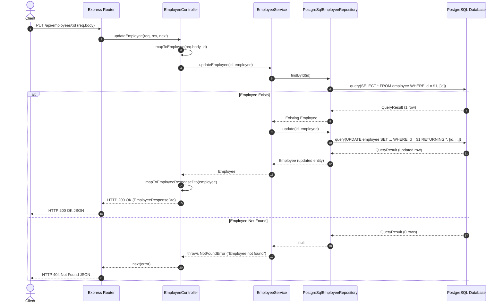

# Update Employee Sequence Diagram

```mermaid
sequenceDiagram
    autonumber
    actor Client
    participant Express as Express Router
    participant Controller as EmployeeController
    participant Service as EmployeeService
    participant Repo as PostgreSqlEmployeeRepository
    participant DB as PostgreSQL Database

    Client->>Express: PUT /api/employees/:id (req.body)
    Express->>Controller: updateEmployee(req, res, next)
    Controller->>Controller: mapToEmployee(req.body, id)
    
    Controller->>Service: updateEmployee(id, employee)
    
    Service->>Repo: findById(id)
    Repo->>DB: query(SELECT * FROM employee WHERE id = $1, [id])
    
    alt Employee Exists
        DB-->>Repo: QueryResult (1 row)
        Repo-->>Service: Existing Employee
        
        Service->>Repo: update(id, employee)
        Repo->>DB: query(UPDATE employee SET ... WHERE id = $1 RETURNING *, [id, ...])
        DB-->>Repo: QueryResult (updated row)
        Repo-->>Service: Employee (updated entity)
        
        Service-->>Controller: Employee
        Controller->>Controller: mapToEmployeeResponseDto(employee)
        Controller-->>Express: HTTP 200 OK (EmployeeResponseDto)
        Express-->>Client: HTTP 200 OK JSON
    else Employee Not Found
        DB-->>Repo: QueryResult (0 rows)
        Repo-->>Service: null
        Service-->>Controller: throws NotFoundError ("Employee not found")
        Controller-->>Express: next(error)
        Express-->>Client: HTTP 404 Not Found JSON
    end
```
