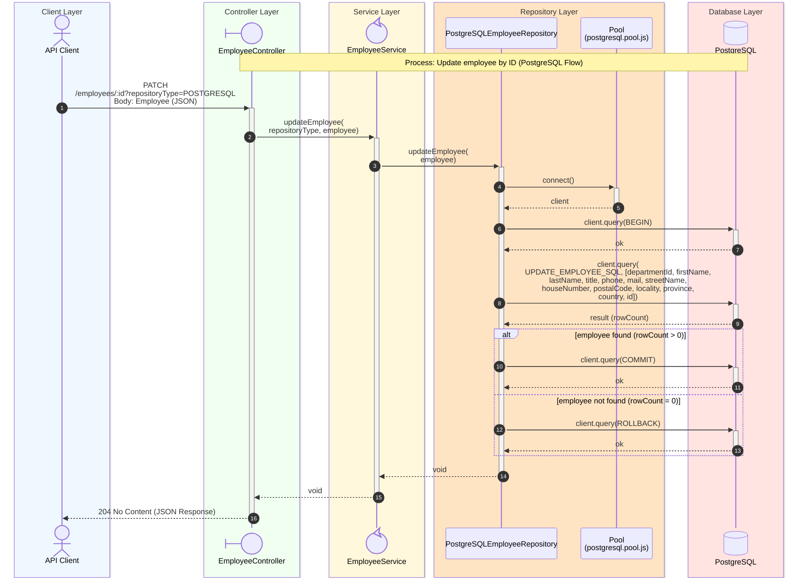

# Update Employee Sequence Diagram

## Process Logic

1. **API Client**: Sends the Request with a JSON body containing the employee's _id_ and the fields to be updated.
1. **Controller**: Receives the Request, extracts the _repositoryType_ from the query string, and maps the request body to an Employee via _bodyToEmployee_, validating that it contains an _id_ (otherwise **400 Bad Request** is returned).
1. **Service**: Acts as an orchestrator, delegating to _postgreSQLEmployeeRepository.updateEmployee_ based on the passed type. Unlike the read/delete flows, no numeric range validation of the _id_ is performed here, since the _id_ originates from the validated request body.
1. **Repository**: Uses the PostgreSQL Pool to acquire a client and, within a transaction, executes the parameterized `UPDATE_EMPLOYEE_SQL` statement, which also allows re-assigning the employee's _departmentId_ as part of the same update.
   - If no row matches the _id_ (`rowCount = 0`), the transaction is rolled back.
   - If the employee row is updated (`rowCount > 0`), the transaction is committed. Unlike the department update flow, no further cascading updates to related entities are performed.
1. **Database**: Executes the `UPDATE` statement and returns the affected row count to the repository.
1. **Controller**: Returns **204 No Content** in all cases where a well-formed body was supplied — the repository does not surface a "not found" condition, so the response does not differ based on whether the employee actually existed.

---
